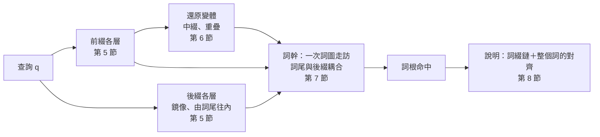

# BCDP：邊界耦合 DP（Boundary-Coupled DP）

低資源語言的辭典查詢，常同時遇到兩種變化：方言或拼寫系統造成的**音變**（巴宰語 `daux`、噶哈巫語 `dox`），以及詞綴造成的**構詞變化**（`minu-dox`）。BCDP 在一次詞圖走訪中同時處理兩者：查詢一個衍生詞，找到詞庫中的詞根，並說明「哪些詞綴、哪些音變」。

模型只有一句話：**一個分析的成本 ＝ 構詞步驟的成本 ＋ 查詢與整個底層字串（詞綴 · 詞根 · 詞綴）的加權編輯距離**。方言規則對整個詞計算，所以可以跨越詞素交界（`ta-kita-aw` 寫成 `takitaw`，a｜a 合併成 a）；詞首、詞尾規則在交界也適用（`tau-'alaw-an` 的喉塞音）；只在交界發生的構詞音變（t → d / _-i）也是同一種規則。

演算法建立在一個觀察上：DP 走到一個詞素交界時，之後的計算只需要知道**交界狀態**（交界上的一列，加上還沒走完、跨越交界的規則）。所以整個詞可以一段一段走，每一段都是同一個動作「從交界狀態出發，在 trie 或詞圖上走訪」；同一個交界上不同來源的狀態逐項取 min 就能精確合併。前綴鏈、後綴鏈各自一層一層合併成一個狀態，詞幹再用一次詞圖走訪把兩端**耦合**起來。名稱中的 D 指 DP，不是 DAWG。

演算法實驗室的「構詞 BCDP」分頁可以逐步觀察整個過程：詞綴各層與交界狀態、通道與詞圖走訪、整個詞的對齊與最終分析（設計見 [lab-design.md](lab-design.md)）。網站上的網址是 `#/lab?tab=bcdp&q=查詢&t=詞根`，例如巴宰–噶哈巫語數位辭典的 `#/lab?tab=bcdp&q=tau'alawan&t=alaw`。

閱讀順序：第 1 節是模型的正式定義；第 2–3 節說明為什麼需要新的做法、從哪裡出發；第 4–8 節一步步推出演算法；第 9 節整理正確性與複雜度；第 10 節是反方向（查詞根找衍生詞）；第 11–12 節是實作與驗證；第 13–15 節是實測、與 FST 的關係和常見誤區。語言設定檔的寫法見 [language-profile.md](language-profile.md#morphology-構詞選填)。

## 1. 問題

### 1.1 輸入與輸出

- **查詢** q = x₁…xₙ：已正規化的 code point 序列（搜尋鍵）。
- **詞庫** 𝓛：搜尋索引中所有長度至少 `minStem` 的詞。除了詞條的詞形、其他寫法與變體，也包括例句中的詞與衍生關係的文字；網站最後只把命中連到可作為詞根的詞條，但 `lemmaSpread` 截斷線是以全部命中計算的。
- **加權編輯距離** E：[fuzzy-search.md](fuzzy-search.md) 第 1–2 節定義的距離，含方言規則與詞首、詞尾限制；加上 1.3 節的交界語意，記為 E_J。
- **構詞規格**（語言設定檔的 `morphology`）：
  - 前綴 Pre、後綴 Suf、中綴 Inf、重疊型式 Red，每項有成本 c（預設 0.3）
  - 包覆單位 Circ（`circumfixes`，沿用「環綴」的欄位名稱）：緊貼詞根的前綴字串 L、詞根上的中綴或重疊型式 op、緊貼詞根的後綴字串 R，一起出現、合起來算一個步驟（1.2 節）
  - 構詞文法（`morphemes`、`constructions`）在載入時展開成上面這些清單，BCDP 看不到文法（[morph-grammar.md](morph-grammar.md)）
  - 構詞音變 Alt（`alternations`）：只在詞素交界適用的規則，格式同方言規則（1.3 第 3 項）
  - `maxSteps`（預設 3）、`minStem`（預設 3）、`lemmaSpread`（預設 0.6）
- **總成本上限** B：搜尋引擎取 min(1, 模糊程度門檻 ＋ 0.6)。模糊程度門檻隨查詢長度 n 而變（標準：clamp(0.2 ＋ 0.15n, 0.3, 1.6)）。

**輸出**：所有 W(q, t) ≤ B 的詞根 t，每個附上成本最低的一個分析。最後只保留成本在「最佳 ＋ `lemmaSpread`」之內的命中。

### 1.2 分析與成本

一個**分析** a 由下列部分組成：

- 前綴鏈 π = p₁ … p_r 與後綴鏈 σ = s₁ … s_u（依詞中的順序），r、u ≤ `maxSteps`
- 至多一個**包覆單位** κ ＝ (L, op, R)：L 是緊貼詞根的前綴字串，op 是詞根上的中綴或重疊（1.4 節），R 是緊貼詞根的後綴字串。各部分都可以沒有，但至少要有 op，或 L、R 都有（例外：只有 L、要求詞根元音開頭的一項，morph-grammar.md 2.3）。單獨的中綴、重疊是 (∅, op, ∅)，前綴式環綴是 (L, ∅, R)，中綴式、重疊式環綴是 (∅, op, R)；(L, op, ∅)、(L, op, R) 是 m<a>- 這類「只有輔音的前綴 ＋ 中綴」（morph-grammar.md 2.2）
- 詞根 t ∈ 𝓛，|t| ≥ `minStem`，t ≠ q

它的**底層字串**是 u(a) = p₁ ⋯ p_r · t · s₁ ⋯ s_u，詞素之間的位置是**交界**。包覆單位緊貼詞根：u(a) ＝ π · L · op(t) · R · σ，op 在查詢上還原（1.4 節）。各部分合起來只付一次成本 c_κ，其他詞綴只能加在它們外面。成本是

$$
\mathrm{cost}(a) = \sum_{j} c_{p_j} + c_\omega + \sum_{j} c_{s_j} + E_J\bigl(q',\ u(a)\bigr)
$$

其中 q′ 是查詢；有非串接步驟時，q′ 是在查詢上拿掉中綴或重疊部分之後的**還原變體**，詞幹的起點固定在 q′ 的某個位置上（1.4 節）。E_J 是整個詞一起算的加權編輯距離：同一套方言規則，規則可以跨越交界，交界上的位置語意見 1.3 節。

$$
W(q, t) = \min_{a:\ \text{詞根是 } t} \mathrm{cost}(a)
$$

**限制**：至少有一個構詞步驟（r ＋ u ＋ [有 ω] ≥ 1；整個查詢對一個詞是普通的模糊命中）；查詢至少要有 `minStem` ＋ 1 個字元，否則不做構詞搜尋。

沒有別的上限。早期的版本另有「詞幹音變上限 λ」與「每個詞綴的音變上限 δ」（`lemmaDistance`、`affixDistance`），在這個模型中移除了：規則跨越交界時，「詞幹部分的音變」沒有良好的定義，而且逐段的預算在 DP 中不能精確計算（變成受限最短路徑）。

**同分**時的說明（成本不受影響）：詞根依成本、再依字典序排列。同一個詞根有幾個成本相同的分析時，說明選步驟少的，再依規格中的順序（rank：文法寫法是自由詞素在前、組合規則在後；平面清單是前綴、後綴、中綴、重疊、環綴，各依清單順序）。這個順序在每一個取 min 的地方套用（詞綴 trie 的合併、環綴的分組、共用通道的步驟、不同通道），只改變記下的來源，不改變 min 的值（morph-grammar.md 2.4、5.3）。同一個交界上，較少詞綴的鏈優先。

### 1.3 交界的語意

底層字串上的每個位置屬於三種之一：**詞首詞尾**（字串兩端、空白旁）、**交界**、**詞中**。

1. **普通的位置不變**：在詞首詞尾，詞首（詞尾）規則照舊要求查詢那一側也在詞首（詞尾）。
2. **詞首、詞尾規則在交界也適用**：底層那一側在交界就可以，查詢那一側不另外檢查——交界就是對齊經過的切點，查詢上沒有對應的「詞首」。巴宰語與噶哈巫語中，詞幹結尾的方言音變在加上後綴之後仍然存在（`babulay` 找得到 `babun`：詞尾的 l→n 在後綴 `-ay` 之前）；元音開頭的詞素接在另一個詞素後面時寫出喉塞音（`tau'alawan` ＝ tau- ＋ alaw ＋ -an），這是一條詞首規則「' ↔ ∅」。
3. **構詞音變只在交界適用**：與方言規則同一個格式，target 碰到交界時才能用（`final`：target 在交界結束；`initial`：在交界開始；沒有指定：任一端）。例如 t → d 在後綴 -i 之前（`bitudun` ＝ bitut ＋ -un）。
4. **跨越交界**：只有沒有位置限制的方言規則可以讓 target 跨越交界，每條規則至多跨越一個交界。例如 `takitaw`（詞典寫作 ta-kita-aw）＝ ta- ＋ kita ＋ -aw，底層的 a｜a 由規則 aa → a 一次處理。
5. **構詞不跨越空白**：查詢中的空白只能落在詞幹內部。詞綴不能消耗空白；交界不能在空白旁（`mu daux` 是兩個詞，不能分析成 mu- ＋ daux）；詞幹本身可以是含空白的詞條。

### 1.4 非串接步驟

中綴與重疊在**查詢的拼寫上**辨認，也就是以方言的形式辨認：

- **中綴** x：在詞幹開頭 i（詞首或某條前綴鏈的終點），查詢的剩餘部分是 h · x · rest。h 是首輔音（群），不能含空白；拿掉 x 之後的首輔音仍須是 h，從 i 起剩下的長度至少 `minStem`；x 必須與查詢完全相同。詞幹必須越過中綴原本的位置。
- **重疊** ρ（型式見 1.6 第 2 項）：在詞幹開頭 i，查詢的剩餘部分是 red · rest，且詞幹（rest 的開頭一段）套用模板正好得到 red。red 不含空白，rest 至少 `minStem` 個字元。
  - 模板只套用在**詞幹**上，不含後綴：`kipu~kipud-i` 的重疊部分由 kipud 產生。
  - 重疊部分複製的是查詢中詞幹的形式，也就是方言形式：巴宰語 `maa-tunu~tunur` 與噶哈巫語 `maa-tono~tono` 的重疊部分跟著各自方言的元音（Lim & Zeitoun 2024, §51.3.2.2）。
  - 重疊部分與詞幹之間是交界。交界上由規則增生的字元（例如喉塞音：`ali~'ali`）不算在詞幹裡，模板略過它。

還原之後，詞幹的起點固定在 q′ 的 i，結束位置只能是模板允許的長度（中綴：越過中綴的位置）。這兩個交界是**固定的**：規則不能跨越它們。

### 1.5 與 FST 聯合最佳解 W* 的關係

把音變 E、構詞 M、詞庫 L 組合成加權有限狀態轉錄器後，最短路徑的成本是 W*（`babizu/fst` 的參考後端、最佳優先搜尋都求它）。在沒有位置規則、沒有構詞音變、沒有非串接步驟時，兩者的定義相同：都是「步驟成本 ＋ 查詢對整個底層字串的編輯距離」。不同的地方：

- W* 只在整個詞的兩端允許詞首、詞尾規則；BCDP 在交界也允許（1.3 第 2 項），所以 W 可以比 W* 低。
- W* 的重疊複製標準形式，再對整個詞套用音變；BCDP 複製查詢的形式（1.4 節）。
- `babizu/fst` 的參考後端只實作 Ca 重疊；其他型式在比較時只有 BCDP 找得到。

實測見第 14 節。

### 1.6 已決定的語意

以下幾點原本沒有定義，由維護者依語言事實決定（2026-09-26）：

1. **構詞不跨越詞邊界**（1.3 第 5 項）。片語中每個詞的構詞分析，交給搜尋引擎的逐詞搜尋。
2. **重疊複製方言形式**，支援的型式：
   - Ca：`da~dius`、`la~luzuk`
   - CV：`ki~kiliw`、`du~dusa`
   - CVV（元音加長）：`dee~depex`、`kii~kita`
   - CGV、CVG（含滑音的音節，使用者心理上的一個 CV）：CGV 前滑音 `ria~riak`（/rja/；riariakan、kaariariak）、`tia~tianak`、`ziu~ziux`（/zju/）；
     CVG 後滑音 `bai~bair`（/baj/；kabaibair）、`tau~taukua`。哪些元音可以當滑音由規格的 `glides` 宣告
   - CVCV，兩音節去韻尾（巴宰語的完整重疊）：`kipu~kipud-i`、`mi-kita~kita`、`luba~lubahing`
   - CVCVC，兩音節含韻尾（噶哈巫語）：`maa-kudung~kudung`
   - full，整個詞幹（單音節詞根）：`saw~saw`

   實際寫進語言設定檔的型式，依詞典證據決定（language-profile.md）。
3. **音變以整個詞計算**：移除 λ、δ，只留總成本上限與 `lemmaSpread`（1.2 節）。
4. **喉塞音是方言規則**：「' ↔ ∅，詞首」。它在詞首與每個交界都適用，取代原本逐一列出的喉塞音詞綴異體（`tau'-`、`kaxi'-`、`-'an`…）。
5. **構詞音變是只在交界適用的規則**（1.3 第 3 項），沒有 `before` 條件；成本 0.05，低於方言規則「濁化」的 0.1，同一個詞兩種解釋都成立時，說明顯示為構詞音變。
6. **步數預算**：前綴、後綴各自最多 `maxSteps` 個，另加至多一個中綴、重疊或環綴。查詞根找衍生詞的自動派生（第 10 節）也用這個預算。
7. **環綴**（2026-09-27）：兩側一起出現的詞綴（`ta-kita-aw`、`<in>…-an`、`da~daux-ay`）是一個步驟，不是兩個。沒有環綴時，`ta-…-aw` 的詞只能分析成兩個詞綴，成本是兩倍，排在只用一個詞綴、音變較多的錯誤詞根之後。
8. **包覆單位**（2026-09-28）：環綴推廣成 (L, op, R)，加上「前綴 ＋ 詞根上的中綴」兩種形狀（m<a>-、m<a>-…-ay）。同位詞素沒有條件、沒有懲罰；同分只影響說明（1.2 節）。理由與資料見 [morph-grammar.md](morph-grammar.md) 第 6 節。

## 2. 為什麼需要新的做法

最直接的做法是把所有可能的分析列出來：對每一種前綴鏈、每一種後綴鏈切出詞幹 q[i..k)，再拿這個片段去做一次普通的模糊搜尋。查詢長 n 時，(i, k) 有 O(n²) 組，每一組都要走一次詞圖。

另一個方向是先精確地剝掉詞綴，再對剩下的詞幹做模糊搜尋；或者先把查詢模糊地對到詞庫中的整個詞，再分析那個詞。兩者都是在聯合最佳化上加了「中間結果必須屬於某個集合」的限制，所以只要音變落在詞綴上（`mine-` 對 `minu-`），或者跨越交界，第一段就已經丟掉了正確答案。在巴宰語的評估中，這類查詢的召回不到 30%（第 13 節）。

較早的 BCDP 做了聯合搜尋，但把查詢**切成段**：前綴鏈、詞幹、後綴鏈各算各的編輯距離再相加。切段本身就是一個限制——任何規則都不能跨越交界。語言中偏偏有很多交界現象：a｜a 合併、交界上的喉塞音、只在後綴前發生的濁化。為了讓它們找得到，語言設定檔只能補上一堆特例：64 個前綴與 5 個後綴的喉塞音異體、一套獨立的「詞幹交替」機制；元音合併則完全找不到（`maxapux` 的 maxa-｜apux）。

所以需要的是：音變與構詞在同一個最佳化中決定，音變對**整個詞**計算，而成本要接近一次普通的模糊搜尋。

## 3. 起點：詞圖上的模糊搜尋

普通的模糊搜尋（[fuzzy-search.md](fuzzy-search.md) 第 3–4 節）已經解決了「一個查詢對整個詞庫」的問題。記 D(x, j) 為把查詢的前 x 個字元轉成候選詞前 j 個字元的最小成本。固定 j 時，(D(0, j), …, D(n, j)) 是一列；第 j 列只依賴候選詞的前 j 個字元，所以所有共用前綴的詞共用同一批列。詞庫存成詞圖（DAWG），深度優先走訪時每個節點算一列，走到詞尾節點就讀出 D(n, |t|)。

剪枝靠的是下界：轉移的成本都不小於 0，往下延伸只會更貴，所以一列的最小值是這個子樹中任何詞的距離下界。多字元規則可以從較早的列直接跳到較深的列，所以下界還要加上「跨列」的部分：路徑上每個「規則 target 已經讀到一半」的狀態，以它起點那一列的最小值加上完成這條規則的最低成本（fuzzy-search.md 第 4 節）。

現在要讓同一套 DP 處理 u(a) ＝ π · t · σ：候選詞不只是 t，而是詞綴與 t 接起來的字串，而且詞綴有很多種接法。

## 4. 交界狀態

把整個底層字串 u 看成 DP 的候選詞，交界是 u 上的一個位置 J。DP 走過 J 之後，還需要知道過去的哪些東西？

- 普通的轉移（替換、刪除、插入、長度 1 的規則）只讀前一列，所以需要**交界列** R(x) ＝ D(x, J)。
- 多字元規則的 target 可以從 J 之前開始、在 J 之後結束，讀的是更早的列 D(·, J − d)。這種規則的 target 以 u[J−d..J) 開頭；它還沒走完，所以在規則 target 的 trie 上停在某個節點 v。需要的是**跨界表** {(v, D(·, J − d))}：每個還沒走完的 target 前段，連同它起點那一列。
- 規則至多跨越一個交界（1.3 第 4 項），所以不必記更早的東西。

> **定理 1（交界狀態充分）**：J 之後的每一格，都只由 J 之後的格子、交界列 R，以及跨界表中的列算出。所以交界狀態 (R, C) 決定了之後的一切：兩個過去不同、交界狀態相同的前綴，之後的所有值都相同。

交界列本身與普通的列只差在位置語意：它是在交界（EDGE_JUNCTION）上算的，詞尾規則與構詞音變在這裡可以結束（1.3 第 2、3 項），X 的切點不能在空白旁（第 5 項）。下一段的第 0 列就是 R：

$$
D(x, J) = R(x), \qquad D(x, J{+}j) \text{ 照原本的遞推式}
$$

另一端也一樣：把詞尾那一段（後綴鏈）由右往左算好，得到它在交界上的狀態，詞幹走到詞尾時再與它**耦合**（第 7 節）。

**合併**是這個模型好用的原因。D 的遞推只有「加一個非負成本」與「取 min」，所以之後的每一格都是交界狀態各項的 (min, +) 線性函數：

> **定理 2（合併）**：兩個交界狀態 (R₁, C₁)、(R₂, C₂)，逐項取 min（跨界表依 trie 節點對齊，缺的一邊當作 ∞）得到 (R, C)。從 (R, C) 出發算出的每一格，等於分別從兩者出發、再逐格取 min。

證明

對 J 之後的格子依 (j, x) 的字典序歸納。每一格是若干個「來源格 ＋ 非負常數」取 min，來源格或者在 J 之後（由歸納假設，是兩者的 min），或者是 R、C 中的某一格（由定義是兩者的 min）。(min, +) 中加法對 min 分配：min(a₁, a₂) ＋ c ＝ min(a₁ ＋ c, a₂ ＋ c)，而 min 可以交換、結合，所以整個式子等於分別計算後取 min。哪些轉移可以用（規則的位置限制、空白遮罩）只看位置，與來源狀態無關，所以兩邊用的是同一組轉移。∎

所以不同的前綴鏈只要在同一個交界上合併，就可以當成**一個**起點：詞幹不必對每一條前綴鏈各走一次。合併時每一格記下是哪一個來源取得最小值（tag），說明時用來找回詞綴鏈（第 8 節）。

較早的「邊界條件」（第 0 列的起點向量 start、詞尾的附加向量 end）是跨界表為空的特例；`FuzzyIndex` 的 `start`、`end` 選項保留作為這個特例的簡寫。

## 5. 詞綴一層一層合併

前綴鏈 p₁ ⋯ p_r 本身也是一段一段接起來的。記 L_s 為「恰好 s 個前綴」的所有鏈在最內側交界的交界狀態，逐項取 min 合併：

$$
L_0 = \text{詞首}, \qquad L_s = \min_{a \in \mathrm{Pre}} \bigl(\mathrm{Walk}_a(L_{s-1}) + c_a\bigr)
$$

Walk_a(L) 是「從交界狀態 L 出發，走完詞綴 a，在詞綴結尾得到的交界狀態」。對所有前綴一起做，就是在**前綴 trie** 上從 L_{s−1} 出發走訪一次：共用開頭的前綴共用列，每走到一個前綴的結尾節點，把那裡的交界狀態加上 c_a 併進 L_s（定理 2）。所以第 s 層只走訪一次前綴 trie，總共 `maxSteps` 次。

- 詞綴不能消耗空白（1.3 第 5 項），走訪時鎖住查詢中的空白。
- 之後的成本只會增加，所以超過 B 的格子直接設為 ∞；某一層完全到不了時停止。
- 各層再合併成一個狀態 P ＝ min_s L_s，tag 記下層數：詞幹接在 P 之後，就同時考慮了所有 1 … `maxSteps` 個前綴的鏈。

**後綴**對稱，由詞尾往內。把查詢反轉、後綴反轉，並把距離函式**鏡像**：每條規則的 source、target 反轉，詞首與詞尾對調。對齊反過來讀就是鏡像的對齊，所以 mirror().distance(reverse(x), reverse(y)) ＝ distance(x, y)。在反轉的查詢上照前綴的做法走後綴 trie，得到各層與合併後的狀態，再換回正向座標（位置 x′ → n − x′；跨界表的 trie 節點反轉回來，變成規則 target 的**後半段** tail）。得到的 S 是詞幹詞尾要耦合的對象：

- S.row(x)：後綴鏈從查詢位置 x 開始的最小成本
- S.pending：{(tail, row)}：規則 target 的後半段 tail 在後綴鏈開頭，row 是 tail 之後那一列

這一步的結果只依賴查詢與上限，以「上限＋查詢」為鍵快取（LRU）。

**環綴的兩側**。合併後的 P、S 已經不知道用了哪個前綴、哪個後綴，而環綴要求兩側配對。所以每個環綴另外算一對狀態，都是「環綴的那一部分是最內層」：

- 左邊：在所有包覆單位的 L 組成的 trie 上，從詞首與從 P 各走訪一次，得到每個 L 的狀態 P_L：「前綴鏈 · L」在每個位置結束的最小成本。狀態的 tag 記下它是從詞首還是從 P 來的。前綴式環綴的詞幹由 P_L 出發；有 op 的包覆單位（m<a>-）的還原變體，起點成本也取自 P_L（第 6 節）。
- 後綴：在鏡像、反轉的包覆單位後綴 trie 上，從詞尾與從各層後綴合併後的狀態各走訪一次，換回正向座標，得到每個 R 的狀態 S_R。沒有 R 的包覆單位不需要這一側。

多數環綴的左邊或後綴對不上查詢，那一對狀態就不存在，也不會產生通道。

## 6. 非串接步驟：還原變體

中綴與重疊不是在兩端加東西。做法是在查詢上把它們**還原**：辨認出非串接步驟，拿掉那一段，得到一個新的字串 q′；q′ 上的問題又回到「前綴鏈 · 詞幹 · 後綴鏈」，只是詞幹的兩個交界固定在查詢的位置上。

詞幹的起點 i 有兩種：詞首（沒有前綴，位置種類是詞首），以及每個 P.row(i) 有限的位置（接在前綴鏈之後，位置種類是交界）。i ＝ 0 兩種都要試，因為構詞音變只在交界適用。對每個起點：

- **中綴**：檢查 1.4 節的條件，拿掉 x。這個變體的起點列只有位置 i 有值（起點成本 ＋ c_x），詞幹只能在中綴的位置之後結束。
- **重疊**：試每一種長度 len，red ＝ q[i..i+len)。拿掉 red（以及交界上增生的字元），詞幹 v[i..i+L) 套用模板必須正好得到 red，所以詞幹只能在這些 L 結束。
  - 列舉 L 不必逐一套模板。令 w 是模板套用在整段 rest 上的結果：每個模板都在位置 |w| 或更早停下，而且只看到停下的位置為止。所以 L ≥ |w| 時結果都是 w，只有 L < |w| 需要逐一計算（`reduplicantStems`，性質測試檢查這個「穩定引理」）。

**外側有 L 的包覆單位**（m<a>-）：詞幹起點 i 的成本不是 P.row(i)，而是 P_L.row(i)（第 5 節「環綴的兩側」）：前綴鏈 · L 在 i 結束。其他都相同。這個量是前綴式環綴已經在用的精確值（定理 2），所以變體列舉的正是所有 π · L · op(t) · R · σ 的分析。

變體的交界是固定的，所以它的起點狀態沒有跨界表，詞尾耦合時也只用 S.row（S 在允許的結束位置上的值，換回原查詢的座標），不用 S.pending。規則因此不能跨越變體的交界；在元音開頭的詞根上，「L ＋ 詞根上的中綴」其實就是串接 L·x，所以文法另外產生一項串接的前綴式環綴，要求詞根元音開頭（morph-grammar.md 2.3），交界語意就是完整的。

同一個位置、同一種拿法、同一個 L（例如在 i 拿掉中綴 in、外側沒有 L）的變體，可能來自單獨的中綴，也可能來自以它為左邊的環綴（`<in>…-an`）。兩者拿掉之後的查詢、詞幹的起點與可以結束的位置都相同，只差在步驟成本與詞尾接什麼。把步驟成本從起點移到詞尾（加法可以交換），詞尾取各步驟的最小值：min(c_x ＋ S.row, c_κ ＋ S_R.row)，它們就共用一個通道（定理 2）；命中是哪一個步驟，由出口的成本決定，同分時選規格中較前的。通道數量通常只有幾個；上限 64 只防病態輸入，超過時標記 `truncated`。

## 7. 詞幹：一次走訪與耦合

詞幹要在詞庫的詞圖上找。每一種起點是一個**通道**：

| 通道         | 起點                         | 詞尾                                    |
| ------------ | ---------------------------- | --------------------------------------- |
| 沒有前綴     | 詞首                         | 與 S 耦合（至少要有一個後綴）           |
| 接在前綴之後 | P（位置種類：交界）          | 與 S 耦合，或就是詞尾（沒有後綴）       |
| 前綴式環綴，依後綴 R 與是否要求元音開頭 | min_κ（P_L ＋ c_κ）（位置種類：交界） | 與 S_R 耦合（一定要接環綴的後綴）；沒有 R 的，與 S 耦合或就是詞尾 |
| 每個還原變體 | 固定的起點 i（外側有 L 時，成本取自 P_L） | 允許的結束位置，接 S.row 或就是詞尾；有 R 的包覆單位改接 S_R.row |

所有通道與普通的模糊搜尋共用**一次**詞圖走訪：詞圖只走一遍，每個節點對每個存活的通道各算一列。某個通道在某個節點被剪掉，只是它不再往下算；父節點把還存活的通道放進清單，所有子節點共用。路徑上的規則 target 匹配只依賴路徑，所有通道共用。

**耦合**：走到詞根 t 的詞尾節點時，算出這一段在交界上的狀態，與 S 接起來。整個詞的成本是三者的最小值：

- 就是詞尾：min_x F(x) ＋ word(x)，F 是允許詞尾規則的列，word 只在查詢結尾為 0。
- 接後綴、不跨界：min_x R_J(x) ＋ S.row(x)，R_J 是詞尾的交界列。
- 接後綴、有規則跨越交界：規則 target ＝（詞幹尾巴已經讀到的一段，路徑上 trie 狀態 s）·（後綴開頭的 tail）。source 占查詢的 [x − |source|, x)，成本是詞幹第 j − depth(s) 列 ＋ 規則權重 ＋ tail 之後那一列在 x 的值。

由定理 1、2，這就是這個通道上詞根 t 的精確成本 W：沒有候選與計價兩個階段，走訪得到的就是答案。

後綴相同的前綴式環綴，詞尾耦合的對象都是 S_R，所以它們的起點（P_L ＋ c_κ）逐項取 min 合併成一個通道，tag 記著每一格是哪一個環綴（同分時記規格中較前的）。起點與詞尾的最小值加起來已經超過上限時，那個通道不建立。

**要求詞根元音開頭的前綴式環綴**（`stemInitial`，morph-grammar.md 2.3）的詞尾與同後綴的通道相同，只是只接以元音開頭的詞根。它們不另建通道，而是併進那個通道，成為以元音開頭的詞的另一個起點：

- 以元音開頭的詞由「原本的起點 ∪ 它們的起點」出發（定理 2），其他詞照常；
- 第 0 列只由起點決定，所以 `FuzzyIndex` 在根節點算好兩套第 0 列，走進每條邊之前依邊的字元換上其中一套（`initialFrom`），之後的列照常計算；
- 所以詞圖只走一次。與另建一個只走元音開頭的詞的通道相比，結果完全相同，元音開頭那一部分的詞圖卻不必再走一次；
- 沒有後綴的那一組併進「接在前綴之後」的通道（詞尾同樣是 S 或詞尾）。

巴宰語的 12 個前綴式環綴（其中 3 個要求元音開頭）因此最多只有 6 個通道（-ay、-i、-aw、-an、-en、-un）。

**剪枝**。走訪的上限是 B，比普通搜尋寬，所以下界要盡量緊。三個都是精確的（不會剪掉上限內的詞）：

1. **列的最小值與跨列下界**：與普通搜尋相同。從前一段延續下來的跨界表，在它還沒走完的淺層也算進去：它的起點列的最小值 ＋ 完成規則的最低成本。
2. **耦合位能**：pot(x) ＝ min_{x′ ≥ x} end(x′)，end 是詞尾在查詢位置 x′ 結束時至少還要付的耦合成本（S.row、word、S.pending 各列的最小值）。對齊在查詢上只會往後走，所以子樹中任何詞的成本 ≥ min_x 列(x) ＋ pot(x)。允許直接結束（word(n) ＝ 0）時位能處處是 0，只有「沒有前綴」通道（一定要接後綴）受益。
3. **相對上限**：最後只保留「最佳 ＋ `lemmaSpread`」之內的命中，而最後的最佳不大於途中任何時候的最佳，所以各通道共用一個上限 min(B, 目前最佳 ＋ `lemmaSpread`)，隨找到的命中收緊。走訪之前先給它一個起點：詞幹與查詢的一段完全相同、兩側直接接上 P、S 的分析（這是真的分析，成本不小於最佳），只要查幾次詞庫。算進「最佳」的詞必須與截斷時相同（不是查詢本身、夠長），否則會剪掉該保留的詞。

定理 3（剪枝是精確的）與證明

(1) 同普通搜尋（fuzzy-search.md 第 4 節）：交界狀態的值都 ≥ 0，跨界表的列只是「更早的列」，跳躍的成本由規則決定。

(2) 任何一個在子樹中結束的對齊，經過第 j 列時在某個查詢位置 x，結束於 x′ ≥ x。之後的轉移成本 ≥ 0，耦合成本 ≥ end(x′) ≥ pot(x)。跨列的規則從第 r < j 列的 x_r 跳過第 j 列時同理：結束位置 ≥ x_r，所以用第 r 列的 min_x 列(x) ＋ pot(x) 加上完成規則的成本。

(3) 記最後的最佳為 b*。途中任何時候的「目前最佳」b 都是某個被接受的命中的成本，所以 b ≥ b*，上限 b ＋ spread ≥ b* ＋ spread。成本 ≤ b* ＋ spread 的詞在任何時候都不會被剪掉，截斷之後的結果不變。起點是真的分析的成本，所以同樣 ≥ b*。∎

## 8. 說明：找回詞綴鏈與整個詞的對齊

走訪只給出成本。命中之後要說明「哪些詞綴、哪些音變」，只對命中的詞計算：

1. **詞幹從哪裡進來、在哪裡出去**：走訪時已經記下耦合的出口（交界列的哪一格，或哪一條跨界規則）。接在前綴之後與前綴式環綴的通道不知道起點，在詞幹上做一次追蹤 DP 找出來；其他通道的起點是詞首或固定的位置。共用通道的環綴、變體的步驟，由起點的 tag 或出口的成本決定是哪一個。外側有 L 的變體，起點那一格若來自 P，就在 L 上做一次追蹤 DP，找到前綴鏈的出口（與前綴式環綴相同）。
2. **詞綴鏈**：合併後的交界狀態每一格記著它來自哪一層、哪一個詞綴（tag）。環綴的狀態記著它來自詞首（詞尾）還是詞綴鏈；後者先在環綴的那一部分上做一次追蹤 DP，找到它是由 P（S）的哪一格進來的，再照常往回追。從那一格出發，在那個詞綴上由前一層的狀態做一次追蹤 DP，找到它是由前一層的哪一格進來的，一層一層追回詞首（後綴追回詞尾）。這只取決於「哪一側、第幾層、從哪一格」，同一次查詢的命中共用備忘。
3. **整個詞的對齊**（`metric.explainSegments`）：把詞綴與詞根接起來，對查詢做一次完整的 DP 並回溯，交界上的格子分成兩層（前一段結束、後一段開始），固定的交界限制路徑必須經過指定的格子。對齊的成本加上步驟成本就是命中的成本（測試逐一比對）。
4. **音變說明**：對齊中每一個不是「相同」的步驟，標出它落在前綴、詞幹、後綴，或跨越交界。搜尋結果只替前幾筆算，其他的在打開說明時才算。

## 9. 正確性與複雜度

**正確性**由前面的步驟串起來：

1. 交界狀態是充分的（定理 1），合併是精確的（定理 2），所以前綴各層、後綴各層與 P、S 就是所有詞綴鏈的精確值。
2. 還原變體涵蓋所有非串接步驟：中綴只能在詞幹開頭的首輔音之後，重疊只能在詞幹開頭，這些起點（詞首與所有 P 有限的位置）都被逐一試過；重疊的詞幹長度由模板決定，列舉是完整的（穩定引理）。包覆單位的每一側都是「那一部分在最內層」的精確狀態（定理 2），所以前綴式環綴的通道與有 op 的包覆單位的變體，涵蓋了所有含包覆單位的分析；外側有 L 的變體，起點成本 P_L.row(i) ＝ min_π（c(π) ＋ E_J(q[0..i), π · L)），i 逐一試過所有有限的位置。要求元音開頭的環綴併進通道之後，以元音開頭的詞的起點是兩個起點逐項取 min（定理 2），其他詞的起點不變，所以每一類詞得到的仍是各自的精確值。
3. 耦合包含詞尾的三種接法，所以每個通道得到的是那一類分析的精確最小值；各通道取 min 就是 W。
4. 剪枝只丟掉下界超過上限的子樹（定理 3），多通道不改變各通道的結果。

所以在還原變體沒有被截斷時（`truncated` 為 false），BCDP 輸出的就是 1.2 節定義的 W，以及 `lemmaSpread` 截斷後的命中。同分規則只改變合併時記下的來源，不改變任何一格的值。實作與定義的一致性由獨立的窮舉參考實作隨機仲裁（第 12 節）。

**停止性**：變體數不超過位置數 × 用法數（外側 L 的種類有限），詞綴鏈至多 `maxSteps` 層，詞圖是有限的 DAG，所以一定會停止。

**複雜度**：記 n 為查詢長度，A 為詞綴 trie 的節點數，V 為還原變體數，C 為跨界表的大小（還沒走完的規則 target 數，實測平均約 12），H 為命中數。

| 步驟       | 時間                                        | 說明                                                   |
| ---------- | ------------------------------------------- | ------------------------------------------------------ |
| 詞綴各層   | O(`maxSteps` × A × n)                       | 每層走訪一次詞綴 trie；依查詢快取                      |
| 還原變體   | O(n² × \|Red\| × (n ＋ \|w\|²))，實際很小   | 重疊逐一試長度；穩定引理之後只算 L < \|w\|             |
| 詞圖走訪   | O(走訪節點 × 存活通道 × n)                  | 耦合在詞尾節點 O(n ＋ C × 規則數)                      |
| 說明       | O(H × 層數 × \|詞綴\| × n ＋ 前幾筆的對齊)  | 詞綴鏈備忘；整個詞的對齊只替前幾筆算                   |

記憶體：每個通道每層兩列（N 列與 F 列）各 n ＋ 1 個浮點數，加上詞尾的交界列；各層的交界狀態 O(`maxSteps` × (1 ＋ C) × n)。

## 10. 查詞根找衍生詞：自動派生圖

反方向是查詞根、找衍生詞（搜尋引擎的 `_derivedTerms`，`src/search/derivations.js`），介面標「**自動派生**」。
不另寫演算法：**把 BCDP 的結果反過來用**。這是演算法推定的關係，與辭典標註的派生（詞條家族、`<` 標註，介面標「確定拆解」「確定派生」「確定同根」）分開計算、分開標示（[concepts.md](concepts.md)「辭典標註與自動推定」）。

### 10.1 定義

- **邊**：建置時對詞庫中每個詞 w（含例句中的詞）執行一次 BCDP（總成本上限 1）。取成本最低的詞根 r（同分的都取），而且 |r| < |w|（以 code point 計）。每一對記一條邊 w → r，附上 BCDP 對 w 的分析（步驟、音變說明、成本）。
- **查詢**：起點是查詢本身（距離 0），加上它的相近寫法：
  - 標準：方言變體，也就是全由方言規則構成、距離 ≤ 0.3 的模糊命中；
  - 寬鬆：所有模糊命中；
  - 精確：不做構詞。
- **走訪**：由起點沿反向的邊往下走。每個詞取總分（起點距離 ＋ 路徑上各條邊的成本）最小的路徑，而且路徑本身的成本不超過自動拆解方向的上限（`_lemmaMax`：min(1, 模糊程度的門檻 ＋ 0.6)；同一個模糊程度，兩個方向的上限相同）。
- **排序**：總分換算成等效距離 0.4 ＋ 總分（`MORPHOLOGY_BASE_SCORE`，與自動拆解相同，見 fuzzy-search.md 第 8 節）。
- **說明**（`LemmaAnalysis`）：
  - 最後一條邊的分析就是命中的 `analysis`：`stem` 是上一層的詞，`steps` 與 `notes` 是這一層的步驟與音變；
  - 上面幾層放在 `chain`（由起點往下，每層 `{term, stem, steps, cost}`）；
  - 起點不是查詢本身時，`variantOf`、`variantDistance`、`variantNotes` 記查詢 → 起點的對齊。

### 10.2 一步一步：查 sungut 找到 pausunguday

pausunguday（「將要造橋」）只出現在《巴宰語詞典》sungut（橋）條下的例句中，辭典沒有另立條目。

1. **建置**：對 pausunguday 執行 BCDP。語言設定檔有組合規則 PU.IRR（pu- ＋ PROG ‹a› ＋ IRR -ay）。
   - 構詞文法編譯時，‹a› 插在含元音的前綴 pu 的首輔音之後，成為 pau；整個規則編成一個環綴 pau-…-ay，一個步驟（[morph-grammar.md](morph-grammar.md) 第 3 節）。
   - 分析：pau-…-ay ＋ sungut，詞根末的 t 在後綴前濁化為 d（構詞音變 t → d，0.05）。成本 0.2 ＋ 0.05 ＝ 0.25。
   - 其他候選：pusungut ＋ ‹a› ＋ -ay（兩個獨立步驟 0.4 ＋ 0.05 ＝ 0.45）、paru- ＋ -ay ＋ r 脫落（0.55，把 pau 當成 paru 的方言形式）。最好的是 sungut，記一條邊 pausunguday → sungut（0.25）。
2. **查詢**：起點 sungut（0）。往下走到 pausunguday，總分 0.25，等效距離 0.65。
3. **例句**：含 pausunguday 的兩句排在五句含 sungut 本身的例句之後、其他自動派生形之前。
4. **說明**：標籤「自動派生 p‹a›u- ＋ sungut ＋ -ay ≈」；點開列出組合規則與它的三個詞素（pu- 鋪設、‹a› 非完成貌、-ay 非實現貌）、音變 d → t 落在詞幹，以及「此為演算法推定…不是辭典的標註」。「查看演算法運作方式」連到實驗室，重現建置時的那一次 BCDP（查詢 pausunguday、詞根 sungut）。

沒有 PU.IRR 時（v0.5.4），最好的詞根是 pusungut，邊是 pausunguday → pusungut（‹a›、-ay 兩個步驟），查 sungut 時經 pusungut 遞移走到（總分 0.65），說明拆成兩層。兩層也找得到，但把成對的 ‹a›…-ay 拆成兩個獨立的詞綴，不符合巴宰語非實現貌的構詞；把它寫成組合規則，分析才正確（language-profile.md「成對的詞綴」）。

### 10.3 性質

1. **兩個方向一致**：「查 r 看到 w（直接的邊）」等價於「查 w 時自動拆解最好的詞根是 r」。每條邊都是 BCDP 算出來的，所以精確性直接沿用第 9 節，不需要第二套演算法。
2. **沒有循環，一定停止**：
   - 每條邊都由較短的詞指向較長的詞，所以詞長遞增的順序就是拓撲順序；
   - 依這個順序鬆弛一遍，就是 DAG 上的最短路徑（`DerivationGraph.descendants`）；
   - 邊的成本都是正的，路徑成本的上限也限制了層數。
3. **只取最好的詞根**：這是雜訊與召回的取捨。
   - 收下 BCDP 的所有詞根（最佳 ＋ lemmaSpread 之內）時，每個查詢平均多出 17.4 個自動派生形，雜訊很多；
   - 只取最好的、再允許遞移時是 6.5 個，召回只少 1.2 個百分點（見 10.7）。
4. **詞根必須在詞庫中**：圖的節點是詞庫的詞。查詢不在詞庫中、也沒有相近寫法時，不會有自動派生形；
   共同的詞根不在詞庫中的，由虛擬詞根找到自動同根的詞（10.5）。
5. **辭典的判斷優先**：同一個詞既是辭典列在查詢條下的派生詞、又是自動派生時，辭典的關係分數較好（查詢的分數 ＋ 0.1，對自動派生的 0.4 ＋ 成本），標籤也用辭典的。例：mukusa 的最好詞根（BCDP）是 kusa，不是 usa；但辭典把它列在 usa 條下，查 usa 時它的例句以「確定派生 usa」排在前面（fuzzy-search.md 第 8 節「例句」）。

### 10.4 與其他命中方式的關係

- **開頭相符、包含**：同一個詞同時是開頭相符（或包含）與自動派生時，改以自動派生呈現、附上說明，分數取兩者較好的（`scoring.js` 的 `mergeMorphMatch`）。例：查 kita，kitakita'en 開頭相符 0.70、自動派生（kita'en 的重疊）0.4 ＋ 0.5 ＝ 0.9，標自動派生、分數 0.70。
- **模糊命中**：取分數較好的一種，同分時模糊命中優先。
- **噪音**：BCDP 在成本上限內允許詞綴上的音變，所以會有不相干的邊，例如 dusa → usa（tu- ＋ d→t ＋ u→uu，0.4）。這類邊的分數是 0.8，排在辭典標註的派生詞與低成本的自動派生之後；介面一律標「自動派生」、說明是推定的。

### 10.5 虛擬詞根與自動同根：共同的詞根不在詞庫中

**問題**：查 binubuer 找不到 mabubuer（噶哈巫分類辭典 14-027「發芽；健壯」）。兩個詞都由 bubuer 衍生：
binubuer ＝ b‹in›ubuer（完成貌），mabubuer ＝ ma- ＋ bubuer（靜態）。但 bubuer（以及更短的 buer）不是任何記錄的詞形：

- 自動拆解（BCDP）只在詞庫中找詞根，查 binubuer 什麼也找不到；
- 自動派生圖的節點也是詞庫的詞，mabubuer 最好的詞根被接到不相干的 buu（ma- ＋ bu~ ＋ 音變，0.6）。

**做法**：把「詞庫中沒有、但由詞庫中的詞拆得出來的詞幹」當成自動派生圖的額外節點（**虛擬詞根**）。

1. **建置**：對每個詞 w，BCDP 在詞庫中找到最好的詞根之後（原本的邊，一條都不動），再以構詞分析器（精確的列舉：
   詞綴原樣、構詞音變算在步驟裡、沒有方言音變）拆出詞幹 v，符合下面四個條件時另外記一條邊 w → v（`virtualRoots`）：
   1. **詞庫裡沒有同樣好的詞根**：v 的成本 ＋ `VIRTUAL_ROOT_PENALTY`（0.1）＜ 詞庫中最好詞根的成本（沒有時一律成立）。
      bakedan 拆出的 baked（0.2）只比詞庫的 baket ＋ 構詞音變 t → d（0.25）便宜 0.05，不建立。
   2. **形狀像詞根**（`isVirtualRootShape`）：比 `minStem` 長，而且至少兩個元音。karaw、kuraw、paraw 都拆得出 raw，
      但一個音節的詞幹太容易巧合相同。
   3. **v 本身是「根」**：v 不能再拆出詞庫中的詞。mabaketan 拆出的 baketan、mabaket 只是 baket 加上一個詞綴，不算。
   4. 只取這個詞成本最低的 v（同分全收）。
   5. **w 本身不是別的詞的詞根**：自動派生圖中有詞以 w 為最好的詞根，或辭典標明某詞 `<` w 時，w 就是根，不往上拆。
      samian 是 masamian、musamian、saasamian 的詞根，不拆成 sa- ＋ mian。條件 5 要知道全部的邊，
      所以建置分兩個階段：先（平行）算完所有詞庫詞根的邊，再算虛擬詞根的邊（`createDerivationAnalyzer` 的 `analyze`、`virtual`）。
2. **查詢**：先與原本完全相同地由查詢與它的相近寫法往下走；再**以建置時同一個函式、同樣的條件**（`virtualRoots`）拆查詢本身：
   詞庫中最好的詞根取自動拆解的結果，查詢是別的詞的詞根時不拆。拆出的虛擬詞根往下走，**只補上第一次沒走到的詞**。
   命中方式是 `sibling`，介面標「**自動同根**」。
   - 兩端對稱，查詢與詞庫中的詞拆出的是同一個詞根。v0.5.6 的查詢端沒有套用條件 1、5，查 masamian 時拆成 masa- ＋ mian，
     與拆成 sa- ＋ mian 的 samian 成了「同根」；自動拆解明明已經得到 ma- ＋ samian。
   - 分數：0.4 ＋ 查詢的拆解成本 ＋ 0.1（詞庫外的詞根）＋ 往下的路徑成本；拆解加往下不超過同一個上限（`_lemmaMax`）。
   - 查詢本身若也在詞庫中，不算自己。
3. **不取代其他命中**（`scoring.js`）：同一個詞已有其他命中時保留原本的（`mergeMorphMatch`；開頭相符、包含除外，照 10.4 附上說明）；
   同一筆記錄有其他命中時也保留原本的（`replacesRecordHit`）。自動同根經過詞庫中沒有的詞根，是把握最小的一種。

**例**：查 binubuer。

- 建置時 mabubuer 在詞庫中最好的詞根是 buu（0.6）；分析器拆出 bubuer（ma-，0.1）、abubuer（m-，0.1）、buer（ma- ＋ bu~，0.2）。
  bubuer、abubuer 形狀像詞根、再拆不出詞庫中的詞，0.1 ＋ 0.1 ＜ 0.6：記兩條邊 mabubuer → bubuer、mabubuer → abubuer。
- 查詢時拆 binubuer 得到 bubuer（‹in›，0.1），是虛擬詞根；往下走到 mabubuer。
- 分數 0.4 ＋ 0.1 ＋ 0.1 ＋ 0.1 ＝ 0.7；標籤「自動同根 bubuer」，彈出框列出 binubuer ＝ bubuer ＋ ‹in›、詞庫外的詞根 ＋0.1、mabubuer ＝ ma- ＋ bubuer，
  並寫明是演算法推定、詞根不在詞庫中（實驗室重現不了，所以沒有連結）。

**收斂**（巴宰–噶哈巫語資料）：

- 只有少數虛擬詞根連到兩個以上的詞庫詞（v0.5.6：34 個），所以詞庫中的詞彼此之間幾乎不會多出同根關係；
  這個方法主要作用在查詢不在詞庫中的時候（binubuer）。
- 前四個條件的效果（虛擬詞根連到兩個以上的詞庫詞的個數）：只要求不在詞庫中 451 個 → 加上形狀 243 → 加上要好 0.1 45 → 加上 v 本身是根 34。
- 加上條件 5 與查詢端的對稱之後，1,402 個凍結的查詢中有自動同根的由 26 個降到 4 個（binubuer、riariakan、kali'angidan、kulusu；
  不含 CGV、CVG 重疊時量的，見 minubizu 研究紀錄 U.16）。維護者確認的四個巧合（maxatulala → tualay、kulusu → malusu、
  manamanam → ma'aamay、iminiyan → aiyan）去掉了三個；kulusu、malusu 共同的 lusu 只有 4 個字元，
  但同樣長度的虛擬詞根中另外六組（depe、hini、tubi、zemu、baya、béya）都像真的同根，所以不提高長度門檻。

**原本的正確性**（minubizu 的 `tools/eval-sibling.mjs`，1,402 個凍結的查詢，比較加上虛擬詞根前後的詞條與例句）：

- 原本的命中（記錄、命中方式、分數）與它們之間的名次順序**全部不變**：1,376 個查詢完全相同，26 個只多出自動同根。
- 6 筆原本只在例句區的記錄，因為多了自動同根的詞條命中，改在詞條區出現（記錄還在，只是換區）。
- 有新增的查詢每個多出平均 4.5 筆、最多 10 筆，都排在原本的命中之後。

### 10.6 檔案、建置與成本

- `search/derivations.json`（格式見 `src/search/derivations.js` 檔頭）：
  - `virtual`：虛擬詞根（10.5，依字典序）；邊的詞根編號 ≥ `count` 時指 `virtual[r − count]`；
  - `steps`：去重的構詞步驟（含語法說明與詞素）；
  - `analyses`：去重的分析，每個是 [成本, 步驟編號, 音變說明]；
  - `edges`：三個一組 [Δ詞, 詞根, 分析]，詞編號是詞圖的字典序名次，存與上一條邊的差。
  - 巴宰–噶哈巫語資料：10,702 個詞、約 9,100 條詞庫詞根的邊與 1,708 條虛擬詞根的邊，gzip 後約 90 KB（格式版本 2；沒有虛擬詞根的版本 1 是 76 KB）。
- 建置（`src/site/derivations.js`）：
  - worker_threads 平行計算，詞編號切成 250 個一塊輪流領取，結果依編號接起來，與單執行緒相同（測試比對）；
  - 以「詞圖、語言設定檔、分析程式（src/fuzzy/、derivations.js、text.js 的原始碼）」的雜湊快取在 `.babizu/cache/`，資料、規格與演算法沒變時不重算；
  - 冷建置約 8–9 秒（單執行緒約 30 秒）。
- 查詢端：`DerivationGraph` 載入時建「詞根 → 衍生詞」的對照，查詢時只走圖，幾乎不花時間。
- 搜尋 Worker 與 docs.json、lexicon.json 一起下載；沒有構詞規格時是空的圖。
- 單元測試與評估工具不經過網站建置：`buildDerivationGraph(built)` 單執行緒建圖，傳給 `new SearchEngine({ ...built, derivations })`。

### 10.7 評估（2,139 組辭典標註的「衍生詞 < 詞根」，查詞根，看衍生詞有沒有以自動派生出現）

圖本身（只看查詢本身往下走）：

| 做法 | 召回 | 每個查詢的自動派生形（平均／p95） |
|---|---|---|
| 舊做法：含詞根原形的詞，逐一以整個詞的聯合對齊驗證，音變 ≤ 0.2 | 87.8% | 3.6／10 |
| BCDP 的所有詞根，直接反查 | 92.4% | 17.4／61 |
| **BCDP 的最好詞根，可遞移（採用）** | **91.2%** | **6.5／20** |

經過搜尋引擎（標準模糊程度，方言變體也當起點，與其他命中方式合併之後；minubizu 的 `tools/eval-derived.mjs`）：

| 版本 | 召回 | 自動派生形個數（平均／中位數／p95） | `_matchTerms` 耗時 ms（中位數／p95） |
|---|---|---|---|
| v0.5.3：舊做法 | 86.0% | 6.9／4／23 | 4.45／9.08 |
| v0.5.4：自動派生圖 | 89.5% | 13.4／7／50 | 3.60／7.09 |
| v0.5.5：開頭相符、包含的詞也附上構詞命中 | **91.4%** | 13.9／7／51 | 3.52／6.95 |

- 三列都用同一份語言設定檔（含 v0.5.5 加上的 PU.IRR 等組合規則），差別只在程式。
- v0.5.5 的召回多出來的，是開頭相符分數較好、原本把自動派生蓋掉的詞（mergeMorphMatch）。
- 自動派生形多了一倍（遞移、方言變體各自的子樹）；分數是各段相加，排在直接命中與辭典標註的派生詞之後。

舊做法（v0.5.3 以前）有三個限制：
- 候選詞必須含有詞根原樣的核心形式（`coreForms`）；
- 音變上限是 0.2；
- 構詞步驟至多 `maxSteps` 個。

所以查 sungut 找不到 pausunguday。它的程式（`coreForms`、`derivations`、`mayDerive`、`jointDistance`）已移除，git 歷史保留。

## 11. 實作技巧

演算法本身沒有規定、但實作時必須注意的地方：

- **全程以 code point 陣列切片，不再正規化**。查詢已經正規化過；片段若再正規化一次，頭尾的空白會被截掉（位置就錯開），UTF-16 切片也會切壞非 BMP 字元。`FuzzyIndex.searchChannels` 因此接受已正規化的 code point 陣列作為查詢。
- **一個原語**：前綴各層、後綴各層、詞幹都是 `FuzzyIndex.searchChannels` 的通道，差別只在選項：`from`（起點的交界狀態）、`onJunction`（走到詞尾時回報交界狀態）、`to`（詞尾耦合）、`lockBoundary`（詞綴不含空白）、`cutoff`（共用的相對上限）。
- **F 列與交界列只在需要時算**：F 列只在「本節點是詞尾」或「有邊界字元的子節點」時；交界列只在詞尾節點、而且通道需要時。
- **詞綴各層依查詢快取**（LRU），命中時不必重走。
- **合併時記 tag**：各層依序合併、同分保留先合併的，所以較少詞綴的鏈優先；同一層之內同分時保留規格中較前的詞綴（`mergeInto` 的比較函式）。`finish` 保留成本相同的各通道候選，只對它們追溯詞綴鏈，再依「步驟數、各步驟的 rank」選一個。
- **自動派生**：建置時算好（第 10 節），查詢時只走圖。
- **還原變體每種拿法只算一次**：同一個中綴形式、同一種重疊型式（例如 CV~…-en、CV~…-un、CV~…-an 與單獨的 CV 重疊）在同一個起點只檢查、套一次模板，再給每個用法各一個變體；環綴的後綴對不上查詢的結尾時，那個用法在還原之前就濾掉。
- **不隨查詢改變的步驟只建一次**：單獨的中綴、前綴式與中綴式環綴的步驟物件在建立搜尋時就建好並凍結，每個查詢共用；重疊的步驟帶著查詢中的重疊部分，每次另建。
- **依第一個字元換起點**（`initialFrom`，第 7 節）：只在根節點多算一套第 0 列，走進每條邊之前換上；更深的跨界狀態由第 0 層推出、容量也依它配置，換了就重新配置。

## 12. 驗證方法

依 competitive-programming 驗題的方法：先有正式定義，再以**與正式實作沒有共同演算法的參考實作**仲裁。

- **參考實作**（`test/fuzzy/reference/`）：
  - `refDistance`：由加權編輯距離的定義直接寫成的 DP，不共用 `fillRow`、規則編譯與路徑匹配器。
  - `refJoint`：整個底層字串的聯合對齊，直接由 1.2–1.3 節寫成：交界的位置語意、構詞音變、跨界限制、空白、固定交界，一格一格照定義判斷。
  - `refMorph`：窮舉 1.2 節定義的所有分析（詞綴鏈、非串接步驟、詞根），每個分析以 `refJoint` 計價；不用交界狀態、不合併、不剪枝。重疊模板以正規表示式另外寫一份。
  - 誠實列出共用的部分：規格的正規化與預設值、規則的展開（`RuleSet.expand`）與成本表。這些由各自的單元測試與規格檢查的非法輸入表守著。
  - 比對的粒度是「每個詞根的最小成本」。同分時選哪一種切法不在仲裁範圍內，由固定案例守著。
- **性質測試**：
  - 交界狀態：一段一段走（前綴 → 詞幹、詞幹 → 後綴、兩個前綴、三段都有跨界規則）＝ `refJoint`；合併 ＝ 分開算再取 min；剪枝前後相同。
  - 詞綴各層：第 s 層 ＝ 所有恰好 s 個詞綴的鏈各自以 `refJoint` 計算再取 min。
  - 相對上限：起點不小於最後的最佳；收緊前後 `finish` 的結果完全相同；走訪不會變多。
  - 整個詞的聯合對齊（`explainSegments`）＝ `refJoint`，含刻意跨越交界的情形。
  - 自動派生圖：每條邊都是最好的詞根、詞根比詞短；切塊計算與一次算完相同；遞移、路徑上限、寬鬆的起點（`test/search/derivations.test.js`）。
  - 構詞音變只在交界適用：普通距離與「拿掉構詞音變的距離函式」完全相同。
  - `initialFrom`：以某些字元開頭的詞換一個起點 ＝ 分成兩個通道各自走訪（含跨界表、剪枝）。
- **隨機仲裁**：隨機產生方言規則（含位置限制、跨界、構詞音變）、詞綴、重疊型式、包覆單位（含外側有 L、沒有 R、要求詞根元音開頭的）與詞庫，由詞根造衍生詞，比對 BCDP 與 `refMorph` 的每個命中與成本。附 **reaching check**：每種重疊型式、中綴、各種形狀的包覆單位、跨界規則、構詞音變與每個交界位置都必須真的出現在命中裡。
- **固定案例**：使用者回報的例子（`tadusaw`、`takitaw`、`tau'alawan`、`kula`、`maxapux`、`ali'ali`、`pukabadan`、`babulay`）寫成測試。
- **錯誤解法動物園**（`npm run zoo`）：在暫存目錄複製原始碼，逐一套用 48 個具名突變（交界遮罩、跨界限制、交界上的查詢側檢查、合併不取 min、耦合位能、相對上限的起點、包覆單位的起點取錯一側、依第一個字元換起點（`initialFrom`）、同分規則反過來、自動派生圖收下所有詞根或依字典序鬆弛、開頭相符的詞不附構詞說明、辭典派生詞從寫法相近的詞條展開、虛擬詞根的條件拿掉、自動同根取代其他命中…），每個都必須被某個測試殺掉；等價突變與不收的理由寫在清單的檔頭。
- **逐位元快照**：私有 repo 以凍結的查詢清單比對改動前後的搜尋結果；同一份語言設定檔下，普通搜尋、詞圖走訪事件、DP 表與距離都逐位元相同。

過去找到並修正的錯誤：舊的查詞根找衍生詞方向（`jointDistance`）在每一段的第 0 列剪枝時沒有算進前一段的跨界表，跨越交界的規則在交界上被剪掉。動物園的一個突變存活，補上對 `refJoint` 的性質測試後發現。

## 13. 實測

> 這一節是 2026-09-27（包覆單位與構詞文法之前）的量測，說明統一模型與環綴帶來的改變。之後的數字見 [morph-grammar.md](morph-grammar.md) 第 7 節與 [language-profile.md](language-profile.md#編寫技巧依-bcdp-的運作原理) 的巴宰語例子。

資料：《巴宰語詞典》標註的「衍生詞 < 詞根」2,075 組（詞根本身在詞庫中）。三個情境：S1 查詢就是衍生詞本身；S2 衍生詞套上一條方言規則；S3 同 S2，並假設衍生詞本身不在詞庫中。S3b 是其中音變落在詞綴上或跨越交界的 630 組。「其他詞幹」是每個查詢除了標註詞根之外還列出的詞根數。

| 策略（2,075 組）                                  | S1 召回／第 1 名／前 3 名 | S3 召回／第 1 名／前 3 名 | S3b 召回  | 其他詞幹（S1） |
| ------------------------------------------------- | ------------------------- | ------------------------- | --------- | -------------- |
| 先精確去詞綴，詞幹完全相同                        | 85.3／76.2／85.3%         | 8.3／7.6／8.3%            | 18.4%     | 0.25           |
| 兩段式的最佳組合（先音變再去詞綴 ∪ 先去詞綴再音變） | 89.5／76.8／87.7%         | 69.8／54.2／69.0%         | 28.3%     | 2.04           |
| 逐段計算的 BCDP，規格帶 69 個喉塞音異體           | 93.5／80.0／90.8%         | 90.5／70.1／88.0%         | 87.1%     | 3.89           |
| 逐段計算的 BCDP，拿掉喉塞音異體                   | 89.6／76.8／87.0%         | 86.7／67.5／84.3%         | 82.2%     | 3.78           |
| BCDP（整個詞計算音變）                            | 94.1／79.9／91.3%         | 91.0／69.7／88.1%         | 88.6%     | 5.27           |
| **＋環綴、滑音增生（當時的網站規格）**            | **94.2／80.1／91.7%**     | **91.3／69.7／88.5%**     | **89.0%** | 5.33           |

- 規格中的 69 個喉塞音異體換成一條方言規則之後，召回反而比帶著異體的逐段計算高；元音合併、交界上的喉塞音不再需要特例。
- 保留集（407 組，規格校訂時沒有看過）：S1 96.1／79.9／91.4%，S3 92.6／69.0／86.5%。
- 環綴讓勸說、非實現等構式的詞根排到前面：`takitaw` → `kita` 由第 8 名（0.7）升到第 1 名（0.4）。詞典的衍生詞對中環綴不多，所以整體數字只小幅上升。
- 「其他詞幹」多了約 1.4 個：音變上限從 λ 放寬到總成本上限，貼著上限的相近詞根也列出來；排序靠成本，第 1 名的比例持平。
- S1 仍然漏掉的 174 組（含詞根不在詞庫的）中，元音合併只剩 6 組，都是詞根短於 `minStem` 的（`aidi < di`）；喉塞音 0 組。其餘多半是規格沒有描述的現象，例如重疊後、後綴前的滑音增生（`apu'apuwan < apu`）。

效能（600 個真實詞；同一行程中新舊版本逐查詢交錯，每個查詢 5 輪取中位數；中位數／p95；新舊版本各用自己的語言設定檔）：

|                                       | 逐段計算＋舊規格（冷／暖）  | 統一模型＋環綴（冷／暖）    |
| ------------------------------------- | --------------------------- | --------------------------- |
| 普通搜尋・標準                        | 1.57／6.33、1.60／5.75 ms   | 1.61／6.05、1.69／6.04 ms   |
| 含構詞・標準                          | 2.98／10.48、2.66／9.52 ms  | 5.80／19.07、5.10／16.03 ms |
| 含構詞・寬鬆                          | 6.62／20.63、6.45／20.55 ms | 9.67／29.93、8.98／27.09 ms |
| BCDP 構詞搜尋本身（1,245 個評估查詢） | 1.22／3.39、1.02／2.89 ms   | 3.03／6.02、2.45／5.28 ms   |

- 統一模型的走訪上限是總成本上限 B，不再是詞幹音變上限 λ（0.3），所以走訪本身比逐段計算慢約一倍；相對上限與耦合位能（第 7 節）把走訪的節點數從 5,118 減到 2,077（每個查詢平均）。
- 環綴之前（統一模型、沒有環綴）含構詞・標準是 4.98／16.73（冷）、4.61／14.55 ms（暖）。19 個環綴原本讓每個查詢多出十幾個通道；依後綴分組（第 7 節）、與同一種拿法的變體共用通道（第 6 節）之後，每個查詢平均 6.8 個通道。冷快取多出的部分主要是環綴兩側的走訪（準備 0.31 → 0.87 ms）。
- 尾端多半是多詞查詢：片語中每個詞各做一次構詞搜尋，很短的詞（`a`、`ma`）的方言變體也進入自動派生方向。

## 14. 與 FST／W* 的實測比較

以通用 WFST 參考後端（`babizu/fst`）求 W*，與 BCDP 的 W 逐一比較標註詞根的成本（每 5 組取 1 組，每個情境 415 組；參考後端沒有實作 CV、CVV、CVCV、CVCVC、full 重疊、環綴與多字元的構詞音變，建構時先去掉）：

| 情境   | W = W* | W > W* | W < W* | 只有 W* 在上限內 | 只有 W 在上限內 | 兩者都超過上限 |
| ------ | ------ | ------ | ------ | ---------------- | --------------- | -------------- |
| S1     | 83.1%  | 0%     | 4.1%   | 0.5%             | 5.5%            | 6.7%           |
| S2、S3 | 81.9%  | 0.2%   | 2.4%   | 1.2%             | 4.1%            | 10.1%          |

- W < W* 的都是參考後端沒有的型式或語意：重疊（`maabakebaket` 的 CVCV、`raaraus` 的 CVV）、環綴、交界上的詞首規則（`maa'isakep` 的喉塞音），W* 只能走較貴的路。
- 只有 W* 找到的例子：`ladamit → lamit`。W* 的重疊複製標準形式 lamit，再把其中一個 l 變成 d；BCDP 的重疊複製查詢的形式（1.6 第 2 項），la 與 da 不同。這是語意的差異，不是遺漏。
- 召回：S1 BCDP 92.8%、WFST 87.7%；第 1 名 78.6% 對 73.0%。

## 15. 常見誤區

- **逐段計算音變再相加。** 規則就不能跨越交界，只好在規格中為每種交界現象補特例（第 2 節）。
- **以為規則不能跨越交界，於是替詞綴加異體。** 喉塞音、元音合併都是對整個詞的規則；交界狀態讓它們自然成立。
- **合併交界狀態時只合併交界列。** 跨界表也要合併，否則合併之後，跨越交界的規則只在某一條鏈上成立。
- **在一段的第 0 列剪枝時忽略前一段留下的跨界表。** 跨越交界的規則在交界上看起來還沒有付錢，列的最小值偏高，會被錯剪（第 10 節）。
- **相對上限把會被丟掉的詞也算進「目前最佳」。** 例如查詢本身：它不是構詞命中，卻會把上限收得太緊。
- **把片段重新正規化。** 會截掉頭尾空白，位置錯開（第 11 節）。
- **讓重疊模板看到後綴。** 單音節詞幹加後綴時會產生語言中不存在的分析（1.4 節）。
- **以為 `lemmaSpread` 只看自己的成本。** 截斷是相對於同一次查詢的最佳命中。
- **以為 W ≥ W\*。** 兩者的語意在交界上的詞首、詞尾規則與重疊上不同（1.5 節），BCDP 可以比 W* 低。

**何時適合用 BCDP**：詞綴清單可以用資料或文法列出、構詞以串接為主再加少數非串接步驟、音變以字元層級的規則描述，而且搜尋必須在瀏覽器中即時完成。**何時不適合**：構詞需要任意的左右文條件或多個非串接步驟的組合（例如中綴之後再重疊），或需要精確的聯合最佳解 W*；這時用完整的 FST（lexc／twolc）或 `babizu/fst` 的最佳優先搜尋。

目前框架不支援、列為已知限制的現象（語言設定檔的維護者決定）：右分支重疊（重疊詞幹的後兩個音節）、把元音連續切成兩個音節（`ziu~ziux`）、詞根短於 `minStem` 的分析（`aidi < di`）、環綴裡面再有詞綴（環綴一定緊貼詞根）。規格中還沒有描述的交界現象都可以用一條方言規則或構詞音變補上，不需要改演算法；例如滑音增生（`apu'apu-w-an`）就是一條構詞音變 u → uw。

## 術語表

| 術語             | 意思                                                                                                          |
| ---------------- | ------------------------------------------------------------------------------------------------------------- |
| 底層字串 u(a)    | 分析 a 的詞綴與詞根依序接起來的字串；詞素之間的位置是交界                                                     |
| 交界狀態         | DP 走到交界時的交界列 R 與跨界表 C；之後的計算只需要它（定理 1）                                               |
| 交界列 R         | 交界上的 DP 列：R(x) 是對齊走到「查詢位置 x、這個交界」的最小成本                                             |
| 跨界表 C         | 還沒走完、跨越交界的規則 target 前段（trie 節點），連同它起點那一列                                           |
| 耦合             | 詞幹走到詞尾時，與後綴一側的交界狀態接起來，得到整個詞的成本                                                  |
| 層 L_s；P、S     | 恰好 s 個詞綴的所有鏈合併後的交界狀態；各層再合併成詞幹起點 P、詞尾耦合對象 S                                  |
| 鏡像距離函式     | 規則的 source、target 反轉，詞首詞尾對調；在反轉的字串上算出同樣的距離                                        |
| 還原變體         | 拿掉中綴或重疊部分之後的查詢；詞幹的交界固定在查詢的位置上                                                    |
| 通道             | 詞圖走訪中的一個搜尋問題（普通搜尋、沒有前綴、接在前綴之後、一個還原變體）                                   |
| 耦合位能 pot     | 詞尾在查詢位置 x 或之後結束時至少還要付的耦合成本；用來收緊剪枝的下界                                         |
| 相對上限         | min(B, 目前最佳 ＋ `lemmaSpread`)，各通道共用                                                                 |
| 構詞音變         | 只在交界適用的規則（`alternations`），例如 t → d 在後綴前                                                     |
| 包覆單位（環綴） | (L, op, R)：緊貼詞根的前綴字串、詞根上的中綴或重疊、緊貼詞根的後綴字串，合起來算一個步驟                      |
| 核心形式         | 詞根本身，或加了中綴、重疊後的樣子；衍生詞一定含有其中之一                                                    |
| W、W*            | BCDP 的最小成本；FST 組合的最短路徑                                                                           |
| B                | 總成本上限                                                                                                    |
| N 列、F 列       | 詞圖走訪中每層最多兩列：N 列假設後面還有字元（不允許詞尾規則），F 列假設這裡是詞尾（fuzzy-search.md 第 3 節） |

## 參考文獻

- Lim, Hong-sui & Elizabeth Zeitoun (2024). Pazeh and Kaxabu. _Handbook of Formosan Languages_, Chapter 51. Leiden: Brill.
- Li, Paul Jen-kuei & Shigeru Tsuchida (2001). _Pazih Dictionary_. Taipei: Institute of Linguistics, Academia Sinica.
- Mohri, Mehryar (2009). Weighted automata algorithms. _Handbook of Weighted Automata_. Springer.
