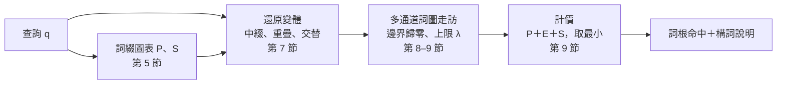

# BCDP：邊界耦合 DP（Boundary-Coupled DP）

低資源語言的辭典查詢，常同時遇到兩種變化：方言或拼寫系統造成的**音變**（巴宰語 `daux`、噶哈巫語 `dox`），以及詞綴造成的**構詞變化**（`minu-dox`）。BCDP 在一次詞圖走訪中同時處理兩者：查詢一個衍生詞，找到詞庫中的詞根，並說明「哪些詞綴、哪些音變」。

它把前綴鏈與後綴鏈的成本各算成一張「位置 → 成本」的圖表，當作詞圖上加權編輯距離 DP 的**邊界條件**：前綴圖表是 DP 的第 0 列（詞幹可以從任何前綴鏈的終點開始），後綴圖表加在詞尾（詞幹可以在任何後綴鏈的起點結束）。遞推式、方言規則與剪枝都沿用普通的模糊搜尋。名稱中的 D 指 DP，不是 DAWG。

演算法實驗室的「構詞 BCDP」分頁可以逐步觀察整個過程：詞綴圖表、還原變體、詞圖走訪、計價格網與最終分析（設計見 [lab-design.md](lab-design.md)）。網站上的網址是 `#/lab?tab=bcdp&q=查詢&t=詞根`，例如巴宰–噶哈巫語數位辭典的 `#/lab?tab=bcdp&q=minubaket&t=baket`。

閱讀順序：第 1 節是模型的正式定義；第 2–9 節一步步推出演算法；第 10 節整理正確性與複雜度；第 11–12 節是實作與驗證；第 13–15 節是實測、與 FST 的關係和常見誤區。語言設定檔的寫法（詞綴、重疊、交替怎麼寫）見 [language-profile.md](language-profile.md#morphology-構詞選填)。

## 1. 問題

### 1.1 輸入與輸出

- **查詢** q = x₁…xₙ：已正規化的 code point 序列（搜尋鍵）。
- **詞庫** 𝓛：可作為詞根的詞，也就是詞條的詞形、其他寫法或變體，長度至少 `minStem`。
- **加權編輯距離** E(u, v)：[fuzzy-search.md](fuzzy-search.md) 第 1–2 節定義的距離，含方言規則與位置限制。
- **構詞規格**（語言設定檔的 `morphology`）：
  - 前綴 Pre、後綴 Suf、中綴 Inf、重疊 Red、詞幹交替 Alt，每項有成本 c（預設 0.3）
  - λ（`lemmaDistance`，詞幹音變上限，預設 0.3）
  - δ（`affixDistance`，每個詞綴的音變上限，預設 0.2）
  - `maxSteps`（預設 3）、`minStem`（預設 3）、`lemmaSpread`（預設 0.6）
- **總成本上限** B：搜尋引擎取 min(1, 模糊程度門檻 ＋ 0.6)。

**輸出**：所有 W_D(q, t) ≤ B 的詞根 t，每個附上成本最低的一個分析。最後只保留成本在「最佳 ＋ `lemmaSpread`」之內的命中。

### 1.2 分析

把查詢看成「前綴鏈 · 詞幹 · 後綴鏈」，詞幹可以帶一個非串接的構詞步驟。一個**分析**由下列部分組成：

- **非串接步驟**（至多一個）：中綴、重疊或詞幹交替，把查詢改寫成一個**還原變體** v（沒有這一步時 v = q）。
- **切點**：0 = b₀ < b₁ < … < b_r = i ≤ k = e₀ < e₁ < … < e_u = |v|。
  - v[b_{j−1}..b_j) 對應前綴 p_j，j = 1 … r
  - v[i..k) 是詞幹的**表面形式**，對應詞庫詞 t
  - v[e_{j−1}..e_j) 對應後綴 s_j，j = 1 … u

分析的成本是各段成本的和：

$$
\mathrm{cost} = \sum_{j=1}^{r} \bigl(c_{p_j} + E(v[b_{j-1}..b_j),\ p_j)\bigr) + c_{\text{op}} + E(v[i..k),\ t) + \sum_{j=1}^{u} \bigl(c_{s_j} + E(v[e_{j-1}..e_j),\ s_j)\bigr)
$$

**限制**：

1. 每個詞綴的音變 E(…, p_j)、E(…, s_j) ≤ δ。
2. 詞幹的音變 E(v[i..k), t) ≤ λ。
3. r ≤ `maxSteps`，u ≤ `maxSteps`。有詞幹交替時，交替後面的第一個後綴另外算，所以 u 最多 `maxSteps` ＋ 1。
4. 至少有一個構詞步驟：r ＋ u ＋ [有非串接步驟] ≥ 1。在原查詢上「整段都是詞幹」的是普通模糊命中，不算。
5. 前綴鏈至少留下 max(1, `minStem` − 1) 個字元給詞幹；後綴鏈只能從第 max(1, `minStem` − 1) 個字元之後開始。

$$
W_D(q, t) = \min_{\text{分析}} \mathrm{cost}
$$

**同分**時取詞幹表面形式較短的切法（詞綴說明較完整）；不同還原變體同分時，取先產生的變體（原查詢最先）。

### 1.3 各段的位置語意

方言規則可以限定只在詞首或詞尾（[fuzzy-search.md](fuzzy-search.md) 第 2 節）。BCDP 把查詢切段以後，各段的邊緣是否算「詞首」「詞尾」如下：

| 段       | 左緣算詞首 | 右緣算詞尾                 |
| -------- | ---------- | -------------------------- |
| 前綴     | 是         | 只在真正的詞尾（或空白前） |
| **詞幹** | **是**     | **是**                     |
| 後綴     | 是         | 只在真正的詞尾（或空白前） |

詞綴與詞幹的標準形式（規格中的寫法、詞庫中的詞）各自當作完整的詞，兩端都算詞首、詞尾。

詞幹兩端都算詞首、詞尾，是有意的設計：巴宰語與噶哈巫語中，**詞幹結尾的方言音變在加上後綴之後仍然存在**（例如 `babulay` 可以找到 `babun`：詞尾的 l→n 發生在後綴 `-ay` 之前）。

### 1.4 非串接步驟

非串接步驟在**查詢的拼寫上**辨認，也就是以方言的形式辨認：

- **中綴** x：在詞幹開頭 i，查詢的剩餘部分是 h · x · rest。其中 h 是首輔音（群，第一個元音之前的字元）。拿掉 x 之後的首輔音仍須是 h。x 必須與查詢完全相同。
- **重疊** ρ（型式見 1.6 第 2 項）：在詞幹開頭 i，查詢的剩餘部分是 red · rest，且詞幹的表面形式 s（rest 的開頭一段）套用模板正好得到 red。
  - 模板只套用在**詞幹**上，不含後綴。例如 `kipu~kipud-i` 的重疊部分由 kipud 產生，不是由 kipudi 產生。兩種讀法只在詞幹只有一個音節或沒有元音時不同，那時套用在「詞幹＋後綴」上會得到語言中不存在的分析（例如把合成的 kanakanan 分析成 kan-an 的 CVCV 重疊）。
  - 重疊部分複製的是查詢中詞幹的表面形式，也就是方言形式；詞幹再以方言規則對應到詞根。這與語法描述一致：巴宰語 `maa-tunu~tunur` 與噶哈巫語 `maa-tono~tono` 的重疊部分，跟著各自方言的元音（Lim & Zeitoun 2024, §51.3.2.2）。
- **詞幹交替** α（underlying → surface，可限定 before）：詞幹表面形式的結尾是 surface，還原成 underlying 後與 t 比較；後面的第一個後綴必須在 before 清單中（有指定時）。

### 1.5 與 FST 聯合最佳解 W* 的關係

把音變 E、構詞 M、詞庫 L 組合成加權有限狀態轉錄器後，最短路徑的成本是 W*（`babizu/fst` 的參考後端、最佳優先搜尋與 rustfst 都求它）。W_D 與 W* **互有高低**，不是上下界：

- **W_D 較高，或找不到**：
  - W* 允許一條多字元規則橫跨詞綴與詞幹的切點，BCDP 不允許。
  - W* 沒有 λ、δ 上限。
  - W* 的中綴、重疊本身也可以有音變，也可以組合。
- **W_D 較低，或只有 BCDP 找到**：兩者的語意不同。
  - W* 只在整個詞的兩端允許詞首、詞尾規則；BCDP 在詞素交界也允許（1.3 節）。
  - W* 的重疊部分複製標準形式，再對整個詞套用音變；BCDP 複製查詢的形式（1.4 節）。
  - W* 的有限狀態組合放不進 CVCV、CVCVC、完整重疊這類「複製」型式（{ww} 不是正規語言），BCDP 在查詢上直接比對。

實測數字見第 14 節。

### 1.6 已決定的語意（2026-09-26）

以下幾點原本沒有定義，由維護者依語言事實決定：

1. **構詞不跨越詞邊界**：
   - 前綴、後綴、中綴與重疊部分都不能包含空白（詞邊界字元）。
   - 詞素交界不能在空白旁：接前綴的詞幹不能以空白開頭，接後綴的詞幹不能以空白結尾。例如 `mu daux` 是兩個詞，不能分析成 mu- ＋ daux。
   - 詞幹本身可以是含空白的詞條（複合詞，例如合成的 `mukan dalum` → mu- ＋ `kan dalum`）。
   - 片語中每個詞的構詞分析，交給搜尋引擎的逐詞搜尋。
2. **重疊複製方言形式**，支援的型式：
   - Ca：`da~dius`、`la~luzuk`
   - CV：`ki~kiliw`、`du~dusa`
   - CVV（元音加長）：`dee~depex`、`kii~kita`
   - CVCV，兩音節去韻尾（巴宰語的完整重疊）：`kipu~kipud-i`、`mi-kita~kita`、`luba~lubahing`
   - CVCVC，兩音節含韻尾（噶哈巫語）：`maa-kudung~kudung`
   - full，整個詞幹（單音節詞根）：`saw~saw`

   實際寫進語言設定檔的型式，依詞典證據決定（language-profile.md）。

3. **構詞音變優先於方言規則**：t／p／k → d／b／g 在後綴前的詞幹交替，成本 0.05，低於方言規則「濁化」的 0.1。同一個詞兩種解釋都成立時，說明顯示為構詞音變。
4. **步數預算以 BCDP 為準**：前綴、後綴各自最多 `maxSteps` 個，另加至多一個非串接步驟（中綴、重疊或交替）。「衍生形」方向使用的列舉式分析器 `analyze` 也用這個預算。

## 2. 樸素做法為什麼不夠

最直接的做法是把所有可能的分析列出來：對每一種前綴鏈、每一種後綴鏈切出詞幹 q[i..k)，再拿這個片段去做一次普通的模糊搜尋。查詢長 n 時，(i, k) 有 O(n²) 組，每一組都要走一次詞圖，一個 10 個字元的查詢就是數十次走訪，還沒算上中綴與重疊的變體。

另一個方向是先精確地剝掉詞綴，再對剩下的詞幹做模糊搜尋；或者先把查詢模糊地對到詞庫中的整個詞，再分析那個詞。兩者都是在聯合最佳化上加了「中間結果必須屬於某個集合」的限制，所以只要音變落在詞綴上（`mine-` 對 `minu-`），或者跨越詞綴與詞幹的交界，第一段就已經丟掉了正確答案。在巴宰語的評估中，這類查詢的召回不到 30%（第 13 節）。

所以需要的是一個**聯合**搜尋：音變與構詞在同一個最佳化中決定，而成本要接近一次普通的模糊搜尋。

## 3. 起點：詞圖上的模糊搜尋

普通的模糊搜尋（[fuzzy-search.md](fuzzy-search.md) 第 3–4 節）已經解決了「一個查詢對整個詞庫」的問題。記 D(k, j) 為把查詢的前 k 個字元轉成候選詞前 j 個字元的最小成本。固定 j 時，(D(0, j), …, D(n, j)) 是一列；第 j 列只依賴候選詞的前 j 個字元，所以所有共用前綴的詞共用同一批列。詞庫存成詞圖（DAWG），深度優先走訪時每個節點算一列，走到詞尾節點就讀出 D(n, |t|)。

剪枝靠的是「一列的最小值是這個子樹中任何詞的距離下界」：轉移的成本都不小於 0，往下延伸只會更貴。某一列的最小值超過上限時，整個子樹都不必走。

BCDP 要做的，是讓這一套在不改遞推式的情況下，同時處理詞綴。

## 4. 關鍵觀察：詞綴只從兩端進入

先不管非串接步驟，只看「前綴鏈 · 詞幹 · 後綴鏈」。固定詞庫詞 t 與切點 (i, k)，一個分析的成本分成三段：前綴鏈的成本、詞幹 E(q[i..k), t)、後綴鏈的成本。前綴鏈與後綴鏈都只由查詢決定，與 t 無關。所以對每個位置先把最好的鏈算好：

- P[i]：把 q[0..i) 切成至多 `maxSteps` 個前綴的最小成本（切不出來時為 ∞）
- S[k]：把 q[k..n) 切成至多 `maxSteps` 個後綴的最小成本

$$
W(q, t) = \min_{0 \le i < k \le n} \ P[i] + E(q[i..k),\ t) + S[k]
$$

> **觀察**：P 只在 DP 的**第 0 列**進入，S 只在**詞尾**進入。
>
> 把第 0 列改成 D(i, 0) = min(P[i], D(i − 1, 0) + del(xᵢ))，也就是「詞幹可以從任何前綴鏈的終點 i 開始，成本從 P[i] 算起」，遞推式照舊，那麼 D(k, |t|) 就是 min over i ≤ k of P[i] + E(q[i..k), t)。詞尾再取 min over k of D(k, |t|) + S[k]，就是上式。

這一步把 O(n²) 組 (i, k) 的最小化收進一次 DP：所有起點同時進行（多源），所有終點在詞尾一起比較。詞庫詞之間照樣共用列，所以仍然是一次詞圖走訪。普通模糊搜尋是 P = [0, ∞, …]、S = [∞, …, 0] 的特例。

定理 1（邊界條件）與證明

令 start、end 為長度 n ＋ 1、值在 [0, ∞] 的向量，D′ 為第 0 列改成 D′(i, 0) = min(start[i], D′(i − 1, 0) + del(xᵢ))、其餘遞推式不變的 DP。則

$$
D'(k, j) = \min_{i \le k} \bigl( \mathrm{start}[i] + E(q[i..k),\ t[1..j]) \bigr)
$$

**證明**：對 (j, k) 的字典序歸納。

- j = 0：第 0 列只有起點與刪除，D′(k, 0) = min_i (start[i] + Σ_{i<m≤k} del(x_m))，正是 E(q[i..k), ε)。
- j ≥ 1：每個轉移把某格延長一個編輯操作（或一條規則），成本是「來源格 ＋ 操作成本」。來源格由歸納假設是 min_i (start[i] + E(q[i..·), t[1..·]))，而在 (min, +) 中加法對 min 分配：(min_i aᵢ) + c = min_i (aᵢ + c)。所以 min 可以提到最外層，裡面剩下的就是原 DP 對固定起點 i 的遞推，由原 DP 的正確性得證。∎

**推論**：min_k D′(k, |t|) + end[k] = min_{i,k} start[i] + E(q[i..k), t) + end[k]。

還有一個細節：詞幹兩端都要算詞首、詞尾（1.3 節）。所以編譯查詢時，把 start 有限的位置標成「額外的詞首」、end 有限的位置標成「額外的詞尾」（`compileQuery` 的 `extraInitial`、`extraFinal`），詞首、詞尾規則才能在詞素交界套用。

## 5. 詞綴圖表是最短路徑

P 與 S 本身也要有效率地算出來。把位置 0…n 當成節點：如果 q[k..i) 在 δ 以內對應到某個前綴 a，就從 k 連一條邊到 i，權重 c_a ＋ E(q[k..i), a)。P[i] 就是從 0 走到 i、最多 `maxSteps` 條邊的最短路徑。

> **定理 3（詞綴圖表）**：這張圖的邊都由左指向右，所以沒有環，權重也都不小於 0。依位置由左而右鬆弛，每個節點被處理時，所有指向它的邊的起點都已經處理完，所以得到的就是最短路徑。

步數預算讓狀態多一維：P[s][i] 是恰好 s 個前綴的最小成本，s = 0 … `maxSteps`，最後 P[i] = min_s P[s][i]，並記下取到最小值的 s，回溯說明時用。S 對稱，由右而左。

邊怎麼找：從位置 k 出發，對「所有前綴組成的 trie」跑一次小型的詞圖 DP，查詢是 q[k..n)。每走到一個詞綴的詞尾節點，那一列 row[l] 就是 E(q[k..k+l), a) 對所有 l 的值，一次得到所有從 k 出發的邊。詞綴 trie 很淺，所以這一步很便宜，而且結果只依賴 q[k..n) 這段字串，可以依字串快取。

最後，詞素交界不能在空白旁（1.6 第 1 項）：把「下一個字元是空白」的前綴鏈終點、「前一個字元是空白」的後綴鏈起點設為 ∞。詞綴本身在掃描時就只收不含空白的片段。

## 6. 剪枝仍然成立

普通模糊搜尋的剪枝下界（[fuzzy-search.md](fuzzy-search.md) 第 4 節）有兩部分：這一列（依子節點選 N 列或 F 列）的最小值，以及多字元規則從較早的列「跳過」這一列的下界。這兩部分只用到兩個事實：所有轉移成本不小於 0，以及跳躍的成本由規則決定。

邊界條件沒有改變這兩個事實：start 只影響第 0 列的值，end 不小於 0、只加在詞尾。所以同一個下界照樣是子樹中任何詞的 D′ ＋ end 的下界（**定理 2**，剪枝仍然安全）。剪枝的程式一行都不用改。

## 7. 非串接步驟：還原變體

中綴、重疊與詞幹交替不是在兩端加東西，第 4 節的觀察不能直接套用。做法是把它們「還原」：在查詢上辨認出非串接步驟，拿掉（或改寫）那一段，得到一個新的字串 v，並為 v 算好自己的 start、end 向量。v 上的問題又回到「前綴鏈 · 詞幹 · 後綴鏈」。

- **中綴**：在前綴鏈的終點 k（P[k] 有限），剩下的查詢是 h · x · rest，拿掉 x。v 的 start 只在 k 有值，P[k] ＋ c_x；end 沿用 S，但位置平移 |x|，而且詞幹必須越過中綴原本的位置（否則拿掉中綴就沒有意義）。
- **重疊**：在前綴鏈的終點 k，試每一種長度 len，red = q[k..k+len)。拿掉 red 之後，詞幹 v[k..k+L) 套用模板必須正好得到 red（1.4 節），所以 end 只在這些 L 上有值。
  - 列舉 L 不必逐一套模板。令 w 是模板套用在整段 rest 上的結果：每個模板都是在位置 |w| 停下（元音串或輔音串在字串結尾或另一類字元處結束），所以 L ≥ |w| 時結果都是 w；只有 L < |w| 需要逐一計算。full 的重疊部分就是詞幹本身，只有 L = |red|（`reduplicantStems`，性質測試檢查這個「穩定引理」）。
- **詞幹交替**：在後綴鏈的起點 l，若 q 在 l 之前以 surface 結尾，就把它換成 underlying。v 的 end 只在換完的位置有值，成本是「第一個後綴（必須在 before 中）＋ 其後至多 `maxSteps` 個後綴 ＋ c_α」；start 沿用 P。

每個變體都帶著 map（v 上的位置 → 原查詢上的位置），回溯說明時換回原查詢的座標。變體數量通常只有幾個；上限 64 只防病態輸入，超過時結果標記 `truncated`。

## 8. 多通道：一次走訪

每個還原變體都是一個獨立的邊界條件 DP，再加上普通的模糊搜尋本身，一個查詢要對同一個詞圖跑好幾次。這些走訪經過的節點大多相同，所以把它們合成一次：詞圖只走一遍，每個節點對每個**存活的通道**各算一列。

- 每個通道有自己的列、自己的上限與剪枝。某個通道在某個節點被剪掉，只是它不再往下算，其他通道照常。
- 父節點算完後，把還沒被剪掉的通道編號放進下一層的存活清單，所有子節點共用這份清單。前一個兄弟的子樹走完才會覆寫它，和 DP 的列一樣，所以每層只需要一份。
- 所有通道都被剪掉時，整個子樹跳過。

因為每個通道看到的列與單獨搜尋時完全相同，結果也完全相同（性質測試逐一比對，包含超過 31 個通道的情形）。

## 9. 兩階段：候選與計價

到這裡已經有一個正確的演算法：把真正的 P、S 當邊界，以總成本上限 B 走訪。但 B 通常接近 1，而詞綴鏈的成本動輒 0.3–0.9，上限寬，剪枝就鬆，走訪幾乎是一次寬鬆搜尋。

限制 2 提供了更緊的條件：詞幹本身的音變不能超過 λ（預設 0.3）。所以分成兩步：

> **觀察**：把邊界向量的有限值全部當成 0、上限取 λ 走訪，由定理 1，找到的正是「存在某個 (i, k) 使 E(v[i..k), t) ≤ λ」的詞 t。
>
> 任何合法分析的詞幹都滿足這個條件（限制 2），所以候選一個也不漏；而 λ 很小，剪枝幾乎和精確查詢一樣緊。

**計價**只對候選做：對每個候選 t，在 v 的所有有限起點 i 與有限終點 k 上，算 d = E(v[i..k), t)，d ≤ λ 時總成本是 start[i] ＋ d ＋ end[k]，取最小。這是限制 2 下的精確值，所以得到的就是 W_D。

計價有兩個容易省下的工作：

- 詞幹長度與 |t| 相差太多的 (i, k) 不可能在 λ 以內，因為每個字元的增刪至少要付「最便宜的單字元增刪」。這個下界事先由成本表與規則算出，先過濾。
- 同一個片段 v[i..k) 要和很多候選比，片段的成本表與規則表（`compileQuery`）只編譯一次，所有候選共用。

最後，所有命中依成本排序，只保留「最佳 ＋ `lemmaSpread`」之內的。這個截斷依賴同一次查詢的其他命中，所以一個詞是否出現，不只由它自己的成本決定。

## 10. 正確性與複雜度

**正確性**由前面的步驟串起來：

1. 詞綴圖表 P、S 是最短路徑（定理 3），所以每個位置的鏈成本是最佳的，且步數不超過預算。
2. 還原變體涵蓋所有非串接步驟：中綴只能在前綴鏈終點後的首輔音之後、重疊只能在前綴鏈終點、交替只能在後綴鏈起點（1.4 節），而這些位置都被逐一試過；重疊的詞幹長度由模板決定，列舉是完整的（穩定引理）。
3. 候選階段不漏（第 9 節的觀察），計價階段精確（對有限的 (i, k) 窮舉）。
4. 剪枝只丟掉下界超過上限的子樹（定理 2），多通道不改變各通道的結果（第 8 節）。

所以 BCDP 輸出的就是 1.2 節定義的 W_D，以及 `lemmaSpread` 截斷後的命中。實作與定義的一致性由獨立的窮舉參考實作隨機仲裁（第 12 節）。

**複雜度**：記 n 為查詢長度，V 為還原變體數，A 為詞綴 trie 的節點數，T 為候選數。

| 步驟     | 時間                                     | 說明                                                              |
| -------- | ---------------------------------------- | ----------------------------------------------------------------- |
| 詞綴圖表 | O(n · A · n)                             | 每個起點在詞綴 trie 上跑一次 DP；以片段字串快取，重複的片段不再算 |
| 還原變體 | O(n² · \|Red\|)，實際很小                | 重疊逐一試長度，每次只算模板一次（穩定引理）                      |
| 詞圖走訪 | O(走訪節點 × 存活通道 × n)               | 上限 λ，剪枝很緊；與一次精確查詢同一個量級                        |
| 計價     | O(T × \|starts\| × \|ends\| × n × \|t\|) | 長度過濾後的 (i, k) 通常很少                                      |

記憶體：每個通道每層兩列（N、F）各 n ＋ 1 個浮點數，加上詞綴圖表 O(maxSteps × n)。

## 11. 實作技巧

演算法本身沒有規定、但實作時必須注意的地方：

- **全程以 code point 陣列切片，不再正規化**。查詢已經正規化過；片段若再正規化一次，頭尾的空白會被截掉（位置就錯開），UTF-16 切片也會切壞非 BMP 字元。`FuzzyIndex.searchChannels` 因此接受已正規化的 code point 陣列作為查詢。
- **F 列只在需要時算**：只有「本節點是詞尾」或「有邊界字元的子節點」時才需要詞尾規則生效的 F 列；每層給 F 列一個專用緩衝，不必每次配置。
- **詞綴掃描依片段字串快取**（LRU），圖表的邊以相對位置存，取用時平移。
- **計價時片段只編譯一次**，所有候選共用；候選詞的正規化也只做一次。
- **衍生形方向**（查詞根找衍生詞，搜尋引擎的 `_derivedTerms`）不是 BCDP，但與它一起決定含構詞搜尋的耗時。那裡的技巧：
  - 衍生詞一定是「前綴鏈 · 核心形式 · 後綴鏈」，其中核心形式是詞幹本身，或加了中綴、重疊、交替後的樣子（`coreForms`）。以此為必要條件（`mayDerive`）先排除只是碰巧含有核心形式的候選，再做列舉式分析。
  - 列舉式分析 `analyze` 依詞備忘（LRU，結果深度凍結）；詞綴依首尾字元分組，組內保持規格順序，所以走訪順序與同分時的選擇不變。
- **說明只要對齊時用 `align`**：它與 `explain(...).alignment` 逐位元相同，但每格只記住回溯會選到的那一個候選，不建整張候選表。

## 12. 驗證方法

依 competitive-programming 驗題的方法：先有正式定義，再以**與正式實作沒有共同程式的參考實作**仲裁。

- **參考實作**（`test/fuzzy/reference/`）：
  - `refDistance`：由加權編輯距離的定義直接寫成的 DP，填表順序與正式實作不同，也不共用 `fillRow`、規則編譯與路徑匹配器。先確認它與 `metric.distance` 逐一相同，之後才拿來當仲裁者。
  - `refMorph`：窮舉 1.2 節定義的所有分析，每段的距離都以 `refDistance` 計算並套用 1.3 節的位置語意；不用詞綴圖表、不用詞圖、不剪枝。重疊的詞幹長度直接逐一套模板，不用穩定引理。
- **隨機仲裁**：隨機產生方言規則、詞綴、重疊型式、交替與詞庫，由詞根造衍生詞（偶爾再加一個隨機改字），比對 BCDP 與 `refMorph` 的每個命中與成本。附 **reaching check**：隨機測試中每種重疊型式、中綴、交替都必須真的出現在命中裡，否則測試失敗（避免「全部通過，但從沒測到」）。
- **固定案例**：每個已知錯誤先寫成描述「應該怎樣」的 `it.fails`，修正後改回 `it` 留作回歸測試。
- **規格檢查的非法輸入表**：每一條非法輸入都要被拒絕，而且訊息要指出是哪個欄位；合法的邊界值要通過。
- **多通道的性質測試**：N 個通道一起走訪 ＝ 各自單獨搜尋，包含邊界向量與超過 31 個通道。
- **工作量守門**：以計數而不是計時，剪枝後計算的列數必須少於不剪枝的 1／4（一般查詢與帶邊界向量各一）。剪枝失效時結果仍然正確，只有這個測試會發現。
- **效能改動的逐位元快照**：私有 repo 以凍結的查詢清單（10,623 項）比對改動前後的搜尋結果；行為改變的修正則確認差異只落在預期的查詢上。

這個流程在 2026-09 的審查中找到並修正了五個實作與定義不一致的地方：

1. 多詞查詢：詞綴圖表與計價把片段重新正規化，頭尾的空白被截掉，位置錯開。
2. 非 BMP 字元：計價以 UTF-16 切片。
3. 詞幹交替的說明：選後綴時沒有套用 before 限制（成本正確，說明中的後綴可能不合規定）。
4. 還原變體超過 16 個時默默截斷，交替變體最先被丟掉；多通道的位元遮罩也限制在 31 個通道。
5. 重疊部分的長度上限寫死為 4；full 重疊把後綴也算進詞幹，實際上不可用。

## 13. 實測

資料：《巴宰語詞典》標註的「衍生詞 < 詞根」2,075 組（詞根本身在詞庫中）；構詞規格是依文法來源校訂的版本（2026-09-26）。三個情境：S1 查詢就是衍生詞本身；S2 衍生詞套上一條方言規則；S3 同 S2，並假設衍生詞本身不在詞庫中。

| 策略（2,075 組）                                    | S1 召回／第 1 名／前 3 名 | S3 召回／第 1 名／前 3 名 | 音變在詞綴或跨界（S3b）召回 | 其他詞幹（S1） | 耗時 p95 |
| --------------------------------------------------- | ------------------------- | ------------------------- | --------------------------- | -------------- | -------- |
| 先精確去詞綴，詞幹完全相同                          | 89.2／79.6／89.2%         | 8.8／8.0／8.8%            | 19.7%                       | 0.26           | 0.10 ms  |
| 兩段式的最佳組合（先音變再去詞綴 ∪ 先去詞綴再音變） | 90.4／77.5／88.3%         | 70.4／54.3／69.5%         | 28.7%                       | 2.07           | 3.32 ms  |
| **BCDP**                                            | **93.5／80.0／90.8%**     | **90.5／70.1／88.0%**     | **87.1%**                   | 3.89           | 3.82 ms  |

- 兩段式在「音變落在詞綴上或跨越交界」的查詢上只有不到 30%，BCDP 是 87%：這正是第 2 節說的，兩段式的第一段就丟掉了正確答案。
- BCDP 多出的「其他詞幹」是它找得到、兩段式找不到的相近詞根；排序靠成本，所以第 1 名的比例沒有因此下降。
- 構詞規格的影響另外以保留集評估（規格若是從同一批詞對學出，直接比較會有資料洩漏）：依文法來源校訂的規格比從詞對學出的規格，第 1 名高 7 個百分點，雜訊少 0.8 個詞幹。

效能（600 個真實詞；同一行程中新舊版本逐查詢交錯，每個查詢 5 輪取中位數；中位數／p95）：

|                                       | 冷快取         | 暖快取         |
| ------------------------------------- | -------------- | -------------- |
| 普通搜尋・標準                        | 1.56／6.20 ms  | 1.62／6.04 ms  |
| 含構詞・標準                          | 3.26／11.65 ms | 3.07／10.16 ms |
| 含構詞・寬鬆                          | 7.46／22.57 ms | 7.17／22.24 ms |
| BCDP 構詞搜尋本身（1,245 個評估查詢） | 1.47／3.74 ms  | 1.27／3.45 ms  |

2026-09 的效能改動之前，含構詞・標準的 p95 是 30.5 ms；主因不是 BCDP，而是衍生形方向（第 11 節）。

## 14. 與 FST／W* 的實測比較

以通用 WFST 參考後端（`babizu/fst`）求 W*，與 BCDP 的 W_D 逐一比較標註詞根的成本（每 5 組取 1 組，每個情境 415 組；WFST 放不進 CV、CVV、CVCV、CVCVC、full 重疊，建構時先去掉）：

| 情境   | W_D = W* | W_D > W* | W_D < W* | 只有 W* 在上限內 | 只有 W_D 在上限內 | 兩者都超過上限 |
| ------ | -------- | -------- | -------- | ---------------- | ----------------- | -------------- |
| S1     | 87.5%    | 0%       | 2.2%     | 1.0%             | 2.4%              | 7.0%           |
| S2、S3 | 84.6%    | 1.0%     | 1.4%     | 1.9%             | 0.5%              | 10.6%          |

- W_D < W* 的多半是重疊：`maabakebaket`（CVCV）、`raaraus`（CVV），WFST 沒有這些型式，只能走較貴的路。
- 只有 W* 找到的例子：`kula → ula`、`ladamit → lamit`，是 BCDP 語意中沒有的切法（例如詞素交界的元音合併）。
- 召回相近（S1：BCDP 92.0%、WFST 90.6%），BCDP 的第 1 名較高（78.3% 對 75.9%）。

較早（2026-09-25，由詞對學出的規格）在 1,245 個評估查詢的全部 8,867 組命中上比較：兩者相同 6,437 組；W_D 較高 149 組、較低 26 組；只有 BCDP 在上限內 269 組，只有 W* 在上限內 1,986 組。W* 多找到的詞根大多貼著上限，同時每個查詢多出 1–1.6 個候選，第 1 名的比例下降 3.6–10.8 個百分點。

效能上（研究紀錄 U.5–U.6，以同等水準的資料結構比較）：在網站的上限與本資料的查詢長度下，BCDP 比最佳優先的乘積搜尋快（構詞搜尋 1.31 對 1.87 ms）。最佳優先搜尋的優點是精確的 W* 與長查詢的擴展性；上限提高時它的耗時增加得快，BCDP 不受影響（詞幹音變另受 λ 限制）。

## 15. 常見誤區

- _*以為 W_D ≥ W*。_* 兩者的語意不同（1.5 節），BCDP 可以比 W* 低，也可以找到 W* 找不到的詞根。
- **在候選階段用真正的邊界值。** 結果一樣正確，但上限變成 B，剪枝鬆掉，走訪變成一次寬鬆搜尋（第 9 節）。
- **把片段重新正規化。** 會截掉頭尾空白，位置錯開（第 11 節）。
- **讓重疊模板看到後綴。** 單音節詞幹加後綴時會產生語言中不存在的分析（1.4 節）。
- **把詞綴段的右緣一律當詞尾。** 詞尾規則會被套用在詞綴與詞幹的交界之外，例如把詞中的 l 當成詞尾的 l→n。
- **以為 `lemmaSpread` 只看自己的成本。** 截斷是相對於同一次查詢的最佳命中（第 9 節）。

**何時適合用 BCDP**：詞綴清單可以用資料或文法列出、構詞以串接為主再加少數非串接步驟、方言差異以字元層級的規則描述，而且搜尋必須在瀏覽器中即時完成。**何時不適合**：構詞需要任意的左右文條件或多個非串接步驟的組合（例如中綴之後再重疊），或需要精確的聯合最佳解 W*；這時用完整的 FST（lexc／twolc）或 `babizu/fst` 的最佳優先搜尋。

目前框架不支援、列為已知限制的現象（語言設定檔的維護者決定）：右分支重疊（重疊詞幹的後兩個音節，而不是前兩個）、元音開頭詞根重疊時插入的喉塞音（`apu~'apu`）、把元音連續切成兩個音節（`ziu~ziux`），以及詞素交界的元音合併（`maxapux`）。

## 術語表

| 術語               | 意思                                                              |
| ------------------ | ----------------------------------------------------------------- |
| 邊界條件、邊界向量 | DP 第 0 列的起點成本 start 與詞尾的附加成本 end                   |
| 詞綴圖表 P、S      | 每個位置之前（之後）最好的前綴鏈（後綴鏈）成本                    |
| 還原變體           | 拿掉中綴、重疊或還原詞幹交替之後的查詢，帶著自己的邊界向量        |
| 通道               | 詞圖走訪中的一個搜尋問題（普通搜尋或一個還原變體）                |
| 候選階段、計價階段 | 以歸零的邊界與上限 λ 找候選；對候選在有限的 (i, k) 上算真正的成本 |
| 表面形式           | 查詢中對應詞幹的那一段（方言的拼寫）                              |
| 核心形式           | 詞幹本身，或加了中綴、重疊、交替後的樣子；衍生詞一定含有其中之一  |
| W_D、W*            | BCDP 分段模型的最小成本；FST 組合的最短路徑                       |
| λ、δ               | 詞幹、詞綴各自允許的音變上限                                      |

## 參考文獻

- Lim, Hong-sui & Elizabeth Zeitoun (2024). Pazeh and Kaxabu. _Handbook of Formosan Languages_, Chapter 51. Leiden: Brill.
- Li, Paul Jen-kuei & Shigeru Tsuchida (2001). _Pazih Dictionary_. Taipei: Institute of Linguistics, Academia Sinica.
- Hutchison, Luke A. D. (2020). Pika parsing. arXiv:2005.06444.
- Mohri, Mehryar (2009). Weighted automata algorithms. _Handbook of Weighted Automata_. Springer.
