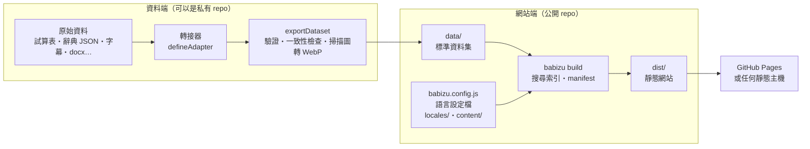

# 概念與架構

Babizu 把「一個語言的辭典網站」拆成三份資料和一個框架：

| 組成 | 形式 | 誰維護 | 說明 |
|---|---|---|---|
| **站台設定** | `babizu.config.js` | 網站維護者 | 名稱、介面語系、語言變體（方言）、搜尋範例、「關於」頁內容 |
| **語言設定檔** | JSON | 語言學／資料維護者 | 正規化、體例符號、編輯成本、方言語音對應規則 |
| **資料集** | JSON＋媒體檔 | 由轉接器產生 | 標準格式的來源、記錄、群組、音檔、掃描圖 |
| **框架**（本套件） | npm 套件 | Babizu | 搜尋演算法、索引、網站介面、建置工具 |

框架本身不知道任何特定語言：語言的知識都在語言設定檔與站台設定裡。

## 資料流

資料端與網站端之間的交換格式是**資料集**（見 [data-format.md](data-format.md)）。兩端可以在同一個 repo，
也可以分開：原始資料有授權限制時，把原始資料與轉接器放在私有 repo，只把轉換後的資料集放進公開的網站 repo。

## 模組

| 子路徑 | 位置 | 職責 | 執行環境 |
|---|---|---|---|
| `babizu/fuzzy` | `src/fuzzy/` | 加權編輯距離、DAWG 詞圖模糊搜尋、語言設定檔 | 瀏覽器＋Node.js，零依賴 |
| `babizu/schema` | `src/schema/` | 標準記錄的 JSON Schema、代碼表、建立記錄的輔助函式 | 瀏覽器＋Node.js（驗證器需要 ajv） |
| `babizu/search` | `src/search/` | 搜尋鍵與斷詞、索引建置、查詢引擎 | 瀏覽器＋Node.js |
| `babizu/dataset` | `src/dataset.js` | 資料集讀寫與驗證 | Node.js |
| `babizu/pipeline` | `src/pipeline/` | 轉接器輔助（試算表、docx、SSA 字幕）、`exportDataset` | Node.js |
| `babizu/site` | `src/site/` | 讀站台設定、準備網站資料、Vite 建置 | Node.js |
| — | `app/` | 網站前端（Vue 3＋shadcn-vue＋Tailwind CSS v4） | 瀏覽器 |
| `babizu` 指令 | `bin/babizu.js` | `dev`／`build`／`preview`／`check`／`locales` | Node.js |

設計原則：

- **建置端與瀏覽器端讀同一份語言設定檔**：索引時的搜尋鍵與查詢時的搜尋鍵由同一段程式、同一份資料算出，不會不一致。
- **語言設定檔是純資料**（JSON），不是程式：可以放在網站 repo、可以被網站下載、也可以被非工程師審閱。
- **轉接器只做格式轉換**，不做語言學修正；有疑問的資料寫進匯出報告或記錄的 `notes`、`quality.flags`。
- **建置可重現、可離線**：需要從外部網站取得的資料，先用一次性的工具抓成本機檔案，轉接器只讀本機檔案。

## 網站的靜態資料

`babizu build` 會在 `<站台>/.babizu/public/data/` 準備這些檔案，再由 Vite 一起輸出到 `dist/`：

| 檔案 | 何時載入 | 內容 |
|---|---|---|
| `manifest.json` | 進站 | 資料版本、各來源分片清單 |
| `sources.json` | 進站 | 來源後設資料與統計 |
| `search/docs.json` | 進站後在 Web Worker 背景載入 | 每筆記錄的搜尋結果摘要（欄式儲存）、語言變體的位元對照與包含關係 |
| `search/lexicon.json` | 同上 | 序列化的詞圖（DAWG）與 posting |
| `search/language.json` | 同上 | 語言設定檔（Worker 用它處理查詢） |
| `records/<來源>/<分片>.json` | 開啟詞條頁、瀏覽頁時 | 完整記錄與群組 |
| `media/…`、`scans/…` | 播放、查看掃描頁時 | 音檔、原書掃描圖 |

所有 JSON 網址都帶 `?v=<manifest.version>`，資料更新後瀏覽器不會拿到舊快取。

## 搜尋

搜尋在 Web Worker 中執行（`app/src/workers/search.worker.js`），主執行緒透過 `SearchClient` 以 Promise 呼叫。

| 查詢 | 資料結構 | 做法 |
|---|---|---|
| 目標語言（模糊） | DAWG 詞圖 | 加權編輯距離＋DFS 剪枝，找出門檻內的詞 |
| 目標語言（前綴／包含） | 字元 → 詞 | 取最少見字元的 posting 當候選，再逐一驗證 |
| 中文 | 單字 → 記錄 | 各字 posting 取交集，再驗證子字串 |
| 英文、臺語羅馬字等 | 詞 → 記錄＋排序詞表 | 整詞命中，或長度 ≥ 3 時比對詞首 |

目標語言的兩種比對合併後依「模糊 → 前綴 → 包含」分組排序，每筆結果標示命中方式。
演算法細節見 [fuzzy-search.md](fuzzy-search.md)。

## 網站

- **路由**（hash 模式，任何子路徑都能部署）：`/`（搜尋＝首頁）、`/r/:source/:localId`（詞條）、`/sources`、
  `/sources/:source/list`、`/sources/:source/:shard?`（瀏覽）、`/lab`（演算法實驗室）、`/about`
- **狀態**：搜尋條件都在網址參數；跨頁共用的狀態放在 `app/src/composables/` 的模組層級單例
- **站台設定**以虛擬模組 `virtual:babizu/site` 注入；名稱、語系、方言顏色等首屏就需要的值直接寫進 `index.html`
- **元件**：`components/ui/`（shadcn-vue new-york-v4 的 JavaScript 版）、`components/common/`（全站共用）、
  `components/search|record|lab/`（各頁專用）。介面規範見 [ui-guidelines.md](ui-guidelines.md)
